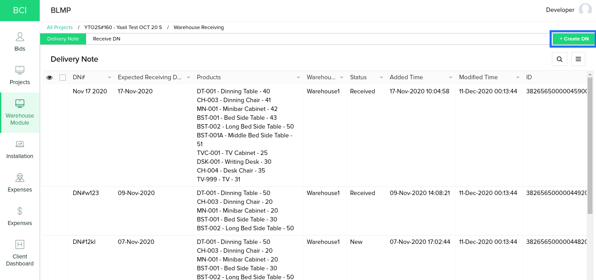
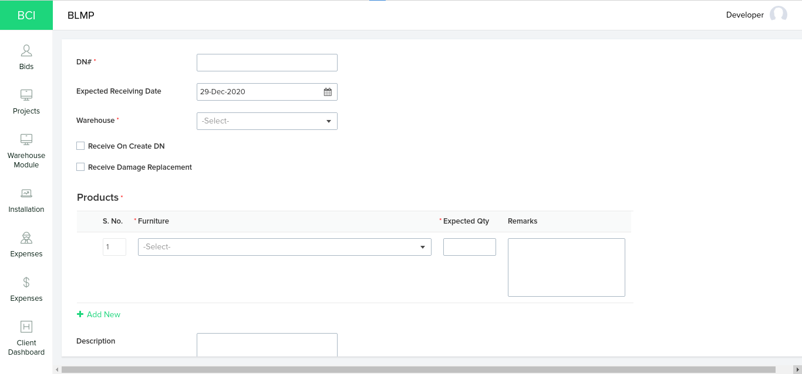
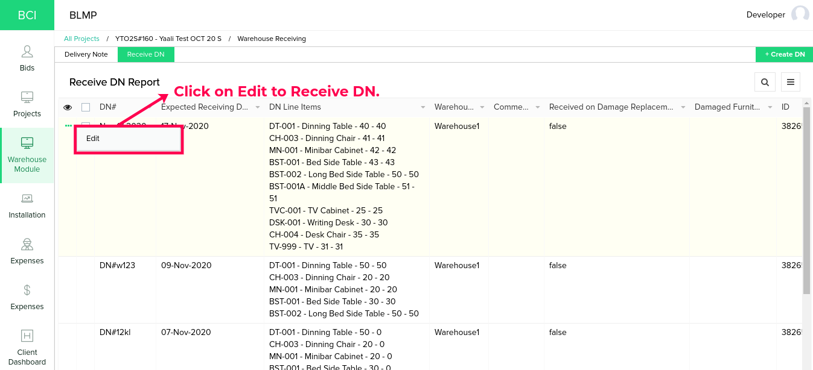
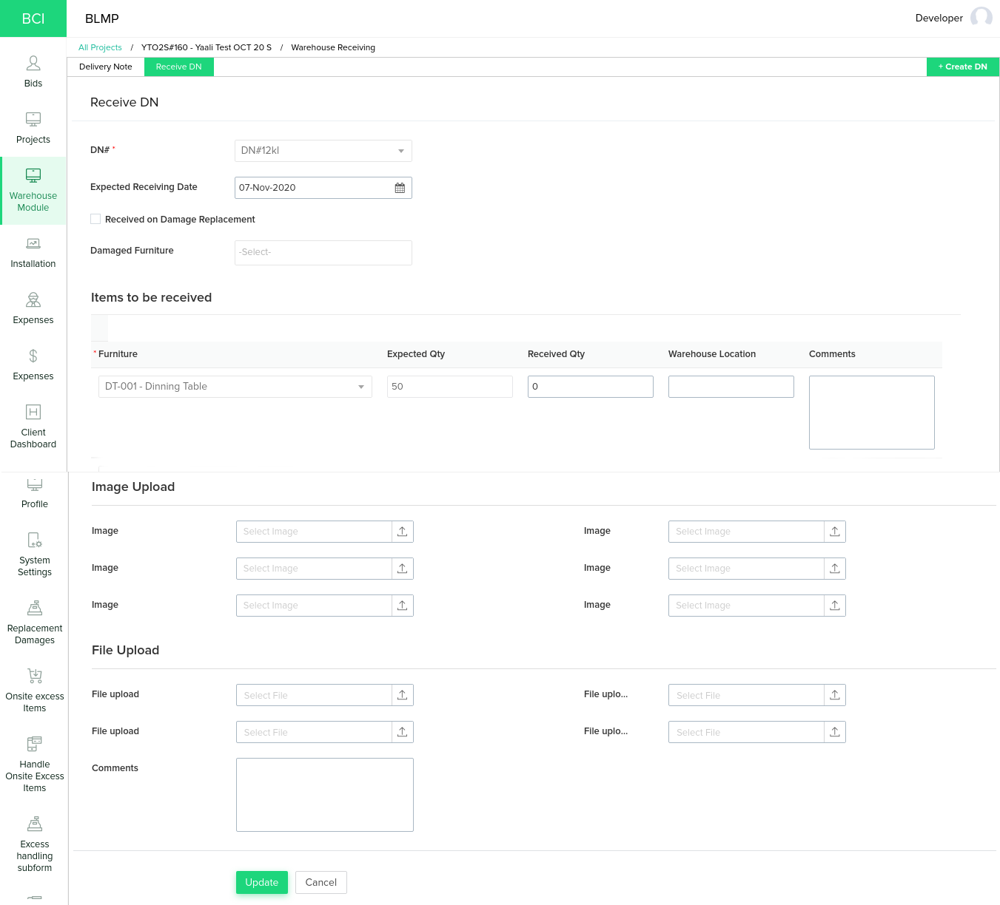
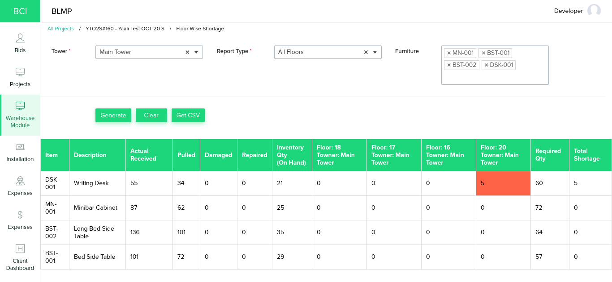
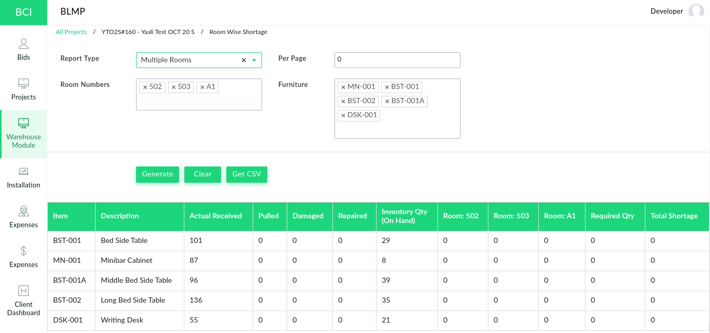

## BLMP Application - Documenation

### Zoho Creator Application

#### Table of Contents

1. [Introduction](#introduction)
2. [Accessing This Application](#accessing-this-application)
   1. [Application User](#application-user)
   2. [Customer Portal User](#customer-portal-user)
3. [Bids](#bids)
   1. [Bid Creation](#bid-creation)
   2. [Bid Pricing](#bid-pricing)
   3. [Bid Approval](#bid-approval)
   4. [Bid to Project Conversion](#bid-to-project-conversion)
4. [Projects](#projects)
   1. [Project Wizard](#project-wizard)
   2. [Project Details](#project-details)
   3. [Hotel Details](#hotel-details)
5. [Warehouse Module](#warehouse-module)
   1. [Warehouse Locations](#warehouse-locations)
   2. [Receiving](#Receiving)
   3. [Picking](#picking)
   4. [Pulling](#pulling)
   5. [Exceptions](#Exceptions)
   6. [Floor Wise Shortage](#floor-wise-shortage)
   7. [Room Wise Shortage](#room-wise-shortage)
   8. [Inventory](#inventory)
6. [Installation](#installation)
   1. [On-Site Receiving](#on-site-receiving)
   2. [Handover Process](#handover-process)
   3. [Installation](#installation)
   4. [Walkthough](#walkthrough)
   5. [Damage Management](#damage-management)
7. [Settings](#settings)
   1. [Customers](#customers)
   2. [Contacts](#contacts)
   3. [Employees](#employees)
8. [Customer Portal](#customer-portal)

#### Introduction 

​        BLMP Application helps to track the project in various of the project from the biding to installation and walk-through process. This application have various processes like [Receiving](#receiving), [Picking](#picking), [Pulling](#pulling), [On-Site Receiving](#on-site-receiving), [Installing](#installation) and [Walkthough](#walkthrough) process based on Project you create with the application to handle furnitures which are needed to a room in a hotel.  This application also include reports like Floor Wise Shortage, Room Wise Shortage and Profitability Report based on data we have generated in a project.

​        This documentation explains various process developed in this application and walk-thought the each stages of process from the bid creation to completing the walkthough process.

#### Accessing This Application

​        BLMP Application can be accessed by users in two different modes, either as application user or customer portal user. Customer Portal mode will have only access to specific module of the application with read-only access. Customer or Agents are given access to the application via customer portal to check on the progress of project in which they are involved. Regular employee like Project Manager, Project Coordinators and Warehouse Staffs will have access to application as Application User.


*Image 1: Zoho Creator Application Dashboard*

##### Application User

​        Application User can gain access to the application when application admin or project manager add them as user in the BLMP application. Once a new user is added to the application a email invite will be sent to given user's email address.

​        To access BLMP application from Zoho Creator Dashboard go to [Zoho Creator login page](https://www.zoho.com/creator/login.html) and login into Zoho Creator account your user name password. For more details refer this [Zoho Creator documentation](https://www.zoho.com/creator/newhelp/getting-started/signin-zoho-creator.html).

​        According to BLMP application user can also be able added as user by adding a employee into the application. This process is explained in detail under [Settings > Employees](#employees) section.

##### Customer Portal User

​        Customers can given access to application via Zoho Creator Customer Portal. Customer can login to the application from [Customer Portal Login Page](https://bciworldwide.zohocreatorportal.com/). Once logged in they will be having access to projects in which they have added as contact as shown in *Image 2*. Granting access to customer portal to customer portal will be explained in details in [*System Setting &#129042; Contacts*](#contacts).

**Customer Portal URL:** *https://bciworldwide.zohocreatorportal.com/*


*Image 2: Zoho Creator Customer Portal project list*

> **Note:** If you added a user to customer portal with email id domain same as app admin Zoho Creator will allow this email as customer portal user. This email can only be added as application user instead.
> 
> *Example:*
> 
> > App Admin Email: admin@bciworldwide.com
> > 
> > Lets assume we are trying to added user3@bciworldwide.com or staff@bciworldwide.com as user in customer portal. It is not possible, the customer portal email should be anything other than ***@bciworldwide.com*** in place of domain name like user2@holidayInn.com or user2@gmail.com or customer@xyzhotel.com can be added to customer portal as user.

#### Bids

​        Bids are feature in BLMP application to maintain details of the Bids BCI is participating. This feature allows to store various details like basic details like Project Name, Customer, Contact, Lead Source and files related receptive bid as shown in *Image 3*. Bid also includes feature adding the project pricing along with a pricing approval process as shown in *Image 4*.


*Image 3: Bid Info page*


*Image 4: Approved Project Pricing under Bid details page.*

##### Bid Creation

We can able to create a Bid in the application by providing some basic regarding the bid as shown in *Image 3*. We can start the Bid creation process from *Bids &#129042; Pricing &#129042; Click on Plus Button* as shown in below *Image 5* . Once the button is clicked it will open a form to collect information regarding the bid as shown in Image 6, Once details are filed in and click on *Submit* a bid will be created in the application and redirected to [Bid Pricing](#bid-pricing).

> ***Note:***
> *Before creating a bid in application customers and contacts needed to be created in customers module. If the customer already exist, the existing customer can be reused. We have explained the customer and contact creation in [Customers](#customers) Section.*


*Image 5: Bids list page.*


*Image 6: Bid Form.*

##### Bid Pricing

​        Bid pricing is a feature used in the application capture your bidding amount over a project/tender. We can also add estimate of pricing split-up of various expenses which you may have on various resources and services which are going to be offering to the customer as *Buy Amount* and *Sell Amount*. The page shown in *Image 15* will be shown immediately after a bid is created.  You can click on *Add Price Type* button to add a new price type into new or existing bid you have created. Form shown in *Image 16* will be opened to collect the price type, sub type and pricing information. While adding price types to a bid, new price type or sub type can be created from the bid from itself.


*Image 15: Bid Pricing Page*

​        


*Image 16: Adding Price Type Bid Pricing.*

​        Once the prices types are added to pricing Bid Pricing Page will looks like as shown in *Image 17*. We enable to option to delete or edit the price type added to the pricing when needed. We have also implemented a approval process for getting permission from user from higher hierarchy. We have discussed the approval process in details under [Bid Approval](#bid-approval) section.


*Image 17: Bid pricing page after adding some price type to the bid.*

##### Bid Approval

​        In bid approval process once bid pricing is completed, The bid can be sent for approval to based on hierarchy. In BLMP Application we have two hierarchy, Bid Creator and Bid Approver. Users under Bid Creator and Bid Approver both have access to create, edit and delete a price type in bid pricing process. But the Bid Approver have privilege to approve or review the bid pricing submitted by Bid Creator as shown in *Image 18*.


*Image 18: Bid Pricing after submitting for approval of Admin Approver*

​        You can notice in the status of *Bid Pricing* is update to *Submitted* from *New*. At this stage users in admin role will not have access to add, modify or delete a price type (i.e., Admin will only have read-only access once submitted for approval). Now users under Admin Approver role will access create, edit or delete access to price types added by Admin user. Apart from this they have privileged to *Approve* a pricing submitted or send it back for *Review* using the *Approve* or *Review* button shown in above *Image 18*.

​        If *Admin Approver* approves the pricing, the bid approval process will be completed and the bid pricing will be locked no more modification in pricing can be done by both the roles.


*Image 21: Approved pricing and Status updated to Approved*

​        If approver clicks on *Review* button, a window will prompt for *Review Comments* as shown in *Image 19*. Admin approver can adding review view in he rich text field and click on submit, Then status of the pricing will be updated to *Review* and Review Comment added by the approver will be shown to admin as shown in *Image 20*. At this stage pricing details can be revised or additional files can be attached by Admin and resubmit the pricing for approval again.


*Image 19: Rich-Text field to get review comment from approver*


*Image 20: Status updated to Review and showing Review Comment added from Admin Approver*

##### Bid to Project Conversion

​        Once a Bid Pricing is approved and win, Bid created can be converted to project directly. You can go to *Bids &#129042; Approved &#129042; Edit* and update the *Stage* of bid to *Win*. Once the bid status is selected the application will show few more field like Project Owner, Employees, Hotel, Warehouse, etc as shown in *Image 21*. Once all those details where given you can click on submit to convert a Bid to a Project and wizard will be opened automatically get gather few more information to setup the project, We have covered this in detail in [Project Wizard](#project-wizard) section . Following are the field description of the project fields.

| Field Name       | Field Description                                                                                                         |
| ---------------- | ------------------------------------------------------------------------------------------------------------------------- |
| Project Owner    | BCI Employee who is going to be point of contact between BCI and Customer.                                                |
| Employees        | Employees with different roles involved in this project. Only user who needs application access is sufficient.            |
| Hotel            | A Hotel model needed to be created. Will holds the information of building and floor we are going to work on this project |
| Warehouse        | Warehouses going to be used in this project for storing he furnitures.                                                    |
| No of Rooms      | Number of rooms involved on this project                                                                                  |
| No of Room Types | Number of room types involved in this project.                                                                            |
*Table 1: Bid to Project Conversion additional field in Bid Form.*


*Image 21: Bid to Project conversion form fields*

> ***FYI:*** *A project can also be created directly by setting the bid stage to **win** directly to avoid the bid approval process.*


#### Projects

##### Project Wizard

        Once [Bid to Project Conversion](#bid-to-project-conversion) is completed the project wizard for will be opened automatically to collect some more information regarding the project like *Furnitures, Rooms Types* and *Rooms*, Which will guide users thought the process of setting up the project in application. A project wizard will looks as shown in *Image 22*. In this wizard you can find options to bulk import details into the application.


*Image 22: Furniture Upload - Project Wizard.*

**Furniture Upload**

​		*Furniture Upload* tab will allow you to upload/import furniture into a project. You can use the *Import Data* feature available in the report shown in *Image 22*. For import the data into this report data should be available as a CSV (Comma Separated Values), XLS or XLSX format with following columns listed in the following *Table 2*.

| Column Name      | Data Type | Description                                                  | Mandatory | Unique |
| ---------------- | --------- | ------------------------------------------------------------ | --------- | ------ |
| Project Code     | String    | Unique project ID assigned to a project you are currently working on. <br />**Note:** Each furniture row in the sheet should have project code value. | True      | False  |
| Furniture name   | String    | Name of the furniture you have importing into project.       | True      | False  |
| Item Code        | String    | Unique furniture code of all furnitures you are importing into application. <br />***Note:*** Case Sensitive. | True      | True   |
| Description      | String    | Detailed description of the furniture                        | False     | False  |
| PO#              | String    | You can adding the PO number from which you expect to receive this furniture. | False     | False  |
| Vendor           | String    | Name of the furniture vendor.                                | False     | False  |
| Project Quantity | Number    | Quantity of the given furniture needed for this project.     | True      | False  |
| Storage Type     | String    | Storage Type                                                 | False     | False  |
*Table 2: Furniture upload data column description.*

> ***Note:*** *In BLMP application, If a furniture, room type or room created or imported to a project it will associate with that project only. This furniture, room type or room will not be accessible from other project in the application. Though, User have access to multiple project in the application.*


##### Project Details

##### Hotel Details

[Room Types Import Template](https://docs.zoho.com/downloaddoc.do?docId=j75urc8eca11b2ced459097448aa255e1be00&docExtn=xlsx)

[Rooms Import Template](https://docs.zoho.com/downloaddoc.do?docId=j75ur2b031e94e8ee4ab38167abd36367d5a9&docExtn=xlsx)

[Furniture Import Template](https://docs.zoho.com/downloaddoc.do?docId=j75urd5cae0ae615542468509e24c421a7da5&docExtn=xlsx)


#### Warehouse Module

​		Warehouse module in BLMP application is used to manage various operations performed in within warehouse and reports which helps to maintain the inventory furnitures which moves in and out of warehouse. This module have various features like Picking, Pulling, Exception, Inventory, Floor wise shortage and Room wise shortage reports. We have covered these features in detail in this section. 

##### Warehouse Locations

​		Warehouse Location is report will have list of warehouse we have used in various projects in this application. To add a new warehouse to the application, we need to provide some basic details like Address, Phone, Email and also need to assign a employee from employee list as in-charge of warehouse. These details will be later be used in the application. User are allowed to create or edit a warehouse in the application. Deleting a warehouse is not permitted, because this will break the relation between records if some records where created with that warehouse.

​		User can access the *Warehouse Locations* from *Warehouse Module &#129042; Warehouse Locations*. The report will open as show in *Image 23*.


*Image 23: Warehouse Locations report in the warehouse module.* 


##### Receiving

​		Receiving module is use to receive furnitures into warehouse in form of Deliver Notes (DN). A delivery can be created  in receiving in order to receive those item into receive those item into warehouse inventory. You can start the receiving process by creating a DN from *Warehouse Module &#129042; Receiving &#129042; Click on Create DN* as shown in the *Image 24*, Once the button is click form shown in *Image 25* will be opened to collect information regarding DN.



*Image 24: Receiving Page - Delivery Note List View.*



*Image 25: DN Creation Form.*

**Create DN:**

​		DN from will collect informations like DN number, Expected Deliver Date, Warehouse and Products list. Warehouse field in the DN allows the system to know to which warehouse these item should be received. We have also given another two options in the DN form, those are *Receive On Create DN* and *Receive Damage Replacement*. If *Receive On Create DN* check box is ticked during DN creation, the receiving of the DN will also be completed at same time. If *DN Creation Form* is submitted without selecting the *Receive On Create DN* this DN will be available for receiving later in Receive DN tab. If *Receive Damage Replacement* check box is ticked, system will allow to receive replacements for damage reported in *Damage Management* or *Exceptions*.

​	In *Products* sub-from you can select furniture you expecting to receive in the DN. The *Furniture* field will list all furnitures you have imported / created in [Project Wizard](#project-wizard). If the furniture you would like to adding is not listed, the furniture should be added from [*Project Wizard*](#project-wizard) or [*Hotel Details*](#hotel-details) page first. 		



*Image 26: Receive DN Page.*



*Image 27: Receive DN form.*

**Receive DN:**

​		In *Receive DN* from shown in *Image 27* is similar to *DN form*. In the *Item to be received* sub-form it will show Expected furniture quantity added in *Create DN* form, Apart from this you can find two other field called *Receive Qty* and *Warehouse Location*.  The *Receive Qty* field hold quantity of the furniture received to warehouse over *Expected Qty*. The *Warehouse Location* field is to store details where the received product is stored with in the Warehouse. This details will later be usefully during [Pulling](#pulling) process and also shown in [Inventory](#inventory). Once the *Receive Qty* and *Warehouse Location* is given you can upload some image and files relevant to this receiving process and click on submit, System will then increase the received quantity in respective warehouse inventory. 

##### Floor Wise Shortage

​		Shortage report show shortage of furnitures stock needed to fulfill furnitures needed to be installed in floor based on *Actual Received* quantity to the warehouse via deliver notes in [Receiving](#receiving) process. This report takes he current actual received quantity from the [Inventory](#inventory) and distribute it throughout the floor created a project. You can access this report from *Warehouse Module &rarr; Floor Wise Shortage*. As shown in *Image 28*, Will list out information like Required Quantity, Actual Received Quantity, Total Shortage Quantity, etc. 

| Column Name                                      | Description                                                  |
| ------------------------------------------------ | ------------------------------------------------------------ |
| Item                                             | Item code of the furniture                                   |
| Description                                      | Furniture full name or description                           |
| Actual Received                                  | Actual quantity of furnitures received in to [Warehouse Inventory](#inventory) via [Receiving](#receiving) process. |
| Pulled                                           | Quantity of furnitures already pulled in [Pulling](#pulling) process and available for On-Site Receiving and Installation. |
| Damaged                                          | Quantity of furnitures reported as damage in warehouse for various reasons. |
| Inventory Qty<br />(On Hand)                     | Quantity of furnitures currently available in inventory and ready for picking from in [Picking](#picking) process. |
| Floor: \<floor_number><br />Tower: \<tower_name> | This columns will show shortage quantity in given floor and tower. <br />If there is any shortage, the shortage count will be shown in cell marked as red. |
| Required Qty                                     | Actual needed quantity of the given furniture in a project.  |
| Total Shortage                                   | Remaining quantity of furniture needed to fulfill all floors in the project. |

*Image 28: Room Wise Shortage Report.*

​		This report have option to export the report in CSV format as shown in *Image 29*. This CSV data can be saved as CSV file and later opened in any spread sheet processing software for better readability. This report also have feature to apply filters to limit the report generation specific to selected Floors and Furnitures if need. 


*Image 29: Floor Wise Shortage report CSV export format.*

>  ***Note:*** *If a project have more number of floors and furnitures the report can not process all floors and furnitures at same time, due Zoho Creator's statement execution limit as mentioned in [this documentation](https://help.zoho.com/portal/en/community/topic/deluge-statement-execution-limit-exceeded-the-maximum-limit). We recommending using the filter option either to limit the number of floors or furnitures to avoid ```"The number of deluge statement execution limit exceeded the maximum limit"``` issue.*


##### Room Wise Shortage

​	Room Wise Shortage report is similar to [Floor Wise Shortage](#floor-wise-shortage) report. Instead of shown the shortages floor wise, this report will show the shortages room wise. You can access this report from *Warehouse Module &rarr; Room Wise Shortage*. This shortage will be as shown in *Image 30,* listing the shortages of furnitures in room based on the *Actual Received* quantity of warehouse inventory. 

| Column Name                  | Description                                                  |
| ---------------------------- | ------------------------------------------------------------ |
| Item                         | Item code of the furniture                                   |
| Description                  | Furniture full name or description                           |
| Actual Received              | Actual quantity of furnitures received in to [Warehouse Inventory](#inventory) via [Receiving](#receiving) process. |
| Pulled                       | Quantity of furnitures already pulled in [Pulling](#pulling) process and available for On-Site Receiving and Installation. |
| Damaged                      | Quantity of furnitures reported as damage in warehouse for various reasons. |
| Inventory Qty<br />(On Hand) | Quantity of furnitures currently available in inventory and ready for picking from in [Picking](#picking) process. |
| Room: \<room_number>         | This columns will show shortage quantity in given room. <br />If there is any shortage, the shortage count will be shown in cell marked as red. |
| Required Qty                 | Actual needed quantity of the given furniture in a project.  |
| Total Shortage               | Remaining quantity of furniture needed to fulfill all floors in the project. |



*Image 30: Room Wise Shortage report.*

​		This report also have option to export the report as CSV format and allows to apply filters to limit the report generation specific to selected Rooms and Furnitures if need. 

> ***Note:*** *If a project have more number of rooms and furnitures the report can not process all rooms and furnitures at same time, due Zoho Creator's statement execution limit as mentioned in [this documentation](https://help.zoho.com/portal/en/community/topic/deluge-statement-execution-limit-exceeded-the-maximum-limit). We recommending using the filter option either to limit the number of rooms or furnitures to avoid ```"The number of deluge statement execution limit exceeded the maximum limit"``` issue.*


#### Inventory

**Overall Inventory**


**Warehouse Inventory**


**Inventory Adjustments**

#### Settings

##### Customers

​        Customers module allow to maintain the details of the customer like Name, Contact Person, Phone, Address, etc. We have given the contacts as sub-form as shown in the *Image 7* since there may be more than one contact person. Contacts can also be able to added or removed from Customer form itself or contact can later be associated to a customer, We have explained this process in [Contacts](#contacts) section. You can create a new customer from *System Settings &#129042; Customers &#129042; Click on Plus Button*. A customer form will be open to collect the customer information.


*Image 7: Customer Form*


*Image 8: Customers List Report.*

##### Contacts

​        Contacts module is similar to customer module allows to store basic information of person how is going to representative of the customer. Customer module also serves as a place where we can enable or disable access of [Customer Portal](#customer-portal). We can create contact in application from *System Settings &#129042; Contacts &#129042; Click on Plus Button*.

> ***Note:*** *Customer should be created first in order to add create or associate a contact to customer. As mentioned in customer section contacts can be created from customer module itself.*


*Image 9: Contact Creation Form.*

If the customer field is selected while creating a contact. The system will automatically associate the created contact with respective customer in Customer module as sub-form line item.

**Granting and Revoking access to Customer Portal**

​        As mentioned in the introduction of the contact module, This module can also used to manages access to customer portal. If a contact is not give customer portal access yet you can field an option called *Grant Customer Portal Access* in *System Settings &#129042; Contacts* as shown in *Image 10*. Once this button is clicked a email invite will be sent to respective email ID added to the contact. Once customer have accepted the invite they have read-only access to the project to which they have added as contact.


*Image 10: Granting customer portal access from Contact module.*

​        If customer is already given access to customer portal *Grant Customer Portal Access* action will not be available any more. Instead you can find a option called  *Revoke Customer Portal Access*, This option allow to revoke access given to customer portal for a given customer as shown in *Image 11*. You can also use *Is Customer Portal Active* column to check a contact is having customer portal access or not.

> ***Note:***
> 
> * *If customer didn't get invite mail in inbox ask them to check in spam or trash once.*
> * *Invalid email ID may be another reason why invite was not sent.*
> * *Maximum number of customer portal user may have reached.*


*Image 11: Revoking customer portal access from Contact module.*


*Image 12: Customer project detail view*

We will discuss regarding the customer portal module in details under [Customer Portal](#customer-portal) section. For information you can also refer to this [Zoho Creator Documentation](https://www.zoho.com/creator/newhelp/application-sharing/understand-customers.html).

##### Employees

​        Employees are application users, These are who is going play various roles in the BLMP Application like Project Manager, Project Coordinator, Warehouse Staff, etc. Based on the roles under which a employee is getting added, the some of modules access will be restricted. For Example, Let us assume we are adding a user under Warehouse Manager Role. He/She will be access to module that are specific to warehouse handling like Overall Inventory, Warehouse Inventory, Warehouses, Picking, etc.  

​        We have used Zoho Creator's roles and permission features to grant or restrict access to various modules of BLMP Application. To know more about the roles and permission please refer this [Zoho Creator Documentation](https://www.zoho.com/creator/newhelp/application-sharing/understand-users.html)

​        You can add a new employee to the application from *System Settings &#129042; Employees &#129042; Add new Employee* button as shown in the *Image 13*.


*Image 13: Employee list report.*


*Image 14: Form to add new employee in application*

​    Once employee details are entered and clicked on submit. Application will add this Employee as user in the BLMP application. An email invite will be sent to email ID given in from while adding a new user.  If you try to edit a existing employee's email ID access to old email ID will be revoked and Invite will we sent to new email ID.

> ***Note:***
> 
> * *User email address should be unique.*
> * *Please check for invite mail in Spam and Trash mail too.*
> * Invalid email ID.
> * Adding the user may fail when maximum number purchased user license have reached.
