## BLMP Application - Documenation

### Zoho Creator Application

#### Table of Contents

1. [Introduction](#introduction)
2. [Accessing This Application](#accessing-this-application)
   1. [Application User](#application-user)
   2. [Customer Portal User](#customer-portal-user)
3. [Bids](#bids)
   1. [Bid Creation](#bid-creation)
   2. [Bid Pricing](#bid-pricing)
   3. [Bid Approval](#bid-approval)
   4. [Bid to Project Conversion](#bid-to-project-conversion)
4. [Projects](#projects)
   1. [All Project List](#all-project-list)
   2. [Project List](#project-list)
   3. [Project Details](#project-details)
   4. [Project Wizard](#project-wizard)
   5. [Project Details](#project-details)
   6. [Hotel Details](#hotel-details)
5. [Warehouse Module](#warehouse-module)
   1. [Warehouse Locations](#warehouse-locations)
   2. [Receiving](#receiving)
   3. [Picking](#picking)
   4. [Pulling](#pulling)
   5. [Exceptions](#exceptions)
   6. [Floor Wise Shortage](#floor-wise-shortage)
   7. [Room Wise Shortage](#room-wise-shortage)
   8. [Inventory](#inventory)
6. [Installation](#installation)
   1. [OnSite Receiving](#onsite-receiving)
   2. [Installation](#installation)
   3. [Walkthough](#walkthough)
   4. [Damage Management](#damage-management)
   5. [Missing Items](#missing-items)
7. [Settings](#settings)
   1. [Customers](#customers)
   2. [Contacts](#contacts)
   3. [Employees](#employees)
8. [Customer Portal](#customer-portal)

#### Introduction 

​        BLMP Application helps to track the project in various of the project from the biding to installation and walk-through process. This application have various processes like [Receiving](#receiving), [Picking](#picking), [Pulling](#pulling), [On-Site Receiving](#on-site-receiving), [Installing](#installation) and [Walkthough](#walkthrough) process based on Project you create with the application to handle furnitures which are needed to a room in a hotel.  This application also include reports like Floor Wise Shortage, Room Wise Shortage and Profitability Report based on data we have generated in a project.

​        This documentation explains various process developed in this application and walk-thought the each stages of process from the bid creation to completing the walkthough process.

#### Accessing This Application

​        BLMP Application can be accessed by users in two different modes, either as application user or customer portal user. Customer Portal mode will have only access to specific module of the application with read-only access. Customer or Agents are given access to the application via customer portal to check on the progress of project in which they are involved. Regular employee like Project Manager, Project Coordinators and Warehouse Staffs will have access to application as Application User.

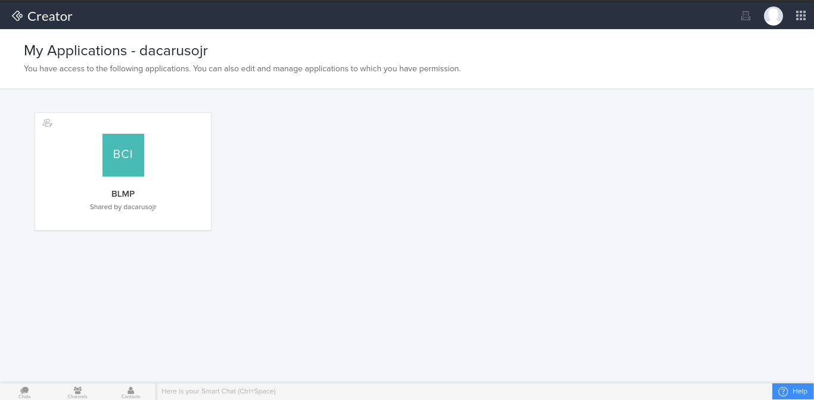
*Image 1: Zoho Creator Application Dashboard*

##### Application User

​        Application User can gain access to the application when application admin or project manager add them as user in the BLMP application. Once a new user is added to the application a email invite will be sent to given user's email address.

​        To access BLMP application from Zoho Creator Dashboard go to [Zoho Creator login page](https://www.zoho.com/creator/login.html) and login into Zoho Creator account your user name password. For more details refer this [Zoho Creator documentation](https://www.zoho.com/creator/newhelp/getting-started/signin-zoho-creator.html).

​        According to BLMP application user can also be able added as user by adding a employee into the application. This process is explained in detail under [Settings > Employees](#employees) section.

##### Customer Portal User

​        Customers can given access to application via Zoho Creator Customer Portal. Customer can login to the application from [Customer Portal Login Page](https://bciworldwide.zohocreatorportal.com/). Once logged in they will be having access to projects in which they have added as contact as shown in *Image 2*. Granting access to customer portal to customer portal will be explained in details in [*System Setting &#129042; Contacts*](#contacts).

**Customer Portal URL:** *https://bciworldwide.zohocreatorportal.com/*

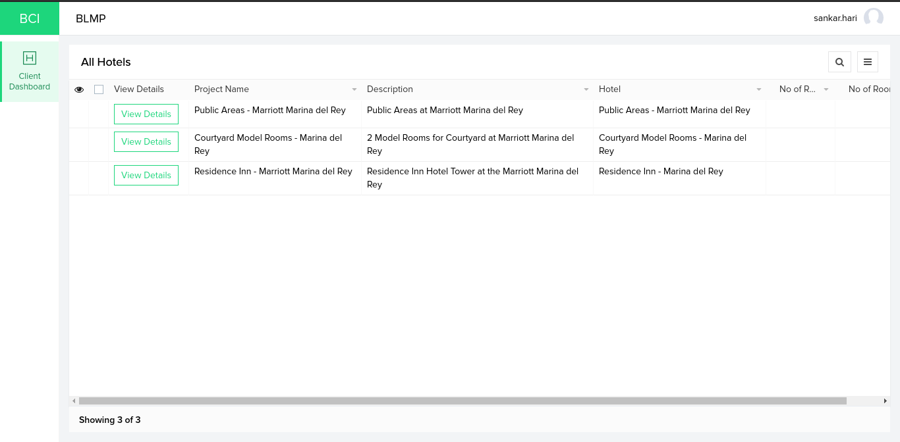
*Image 2: Zoho Creator Customer Portal project list*

> **Note:** If you added a user to customer portal with email id domain same as app admin Zoho Creator will allow this email as customer portal user. This email can only be added as application user instead.
> 
> *Example:*
> 
> > App Admin Email: admin@bciworldwide.com
> > 
> > Lets assume we are trying to added user3@bciworldwide.com or staff@bciworldwide.com as user in customer portal. It is not possible, the customer portal email should be anything other than ***@bciworldwide.com*** in place of domain name like user2@holidayInn.com or user2@gmail.com or customer@xyzhotel.com can be added to customer portal as user.

#### Bids

​        Bids are feature in BLMP application to maintain details of the Bids BCI is participating. This feature allows to store various details like basic details like Project Name, Customer, Contact, Lead Source and files related receptive bid as shown in *Image 3*. Bid also includes feature adding the project pricing along with a pricing approval process as shown in *Image 4*.

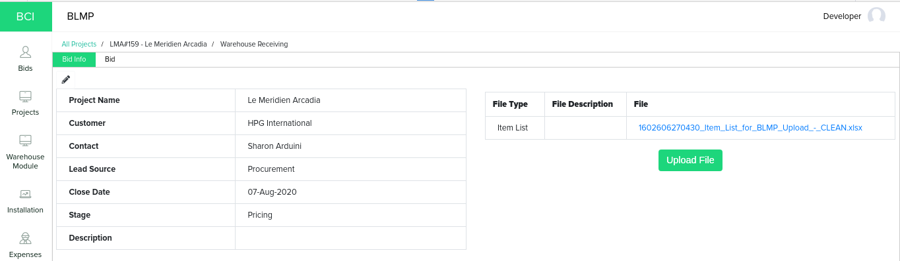
*Image 3: Bid Info page*

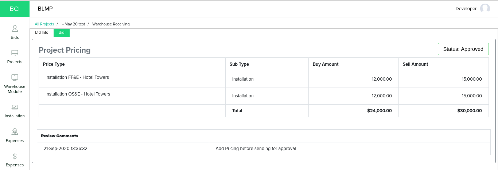
*Image 4: Approved Project Pricing under Bid details page.*

##### Bid Creation

We can able to create a Bid in the application by providing some basic regarding the bid as shown in *Image 3*. We can start the Bid creation process from *Bids &#129042; Pricing &#129042; Click on Plus Button* as shown in below *Image 5* . Once the button is clicked it will open a form to collect information regarding the bid as shown in Image 6, Once details are filed in and click on *Submit* a bid will be created in the application and redirected to [Bid Pricing](#bid-pricing).

> ***Note:***
> *Before creating a bid in application customers and contacts needed to be created in customers module. If the customer already exist, the existing customer can be reused. We have explained the customer and contact creation in [Customers](#customers) Section.*

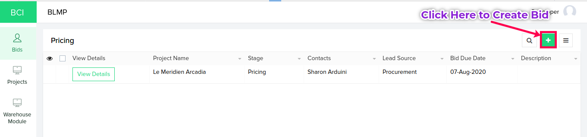
*Image 5: Bids list page.*

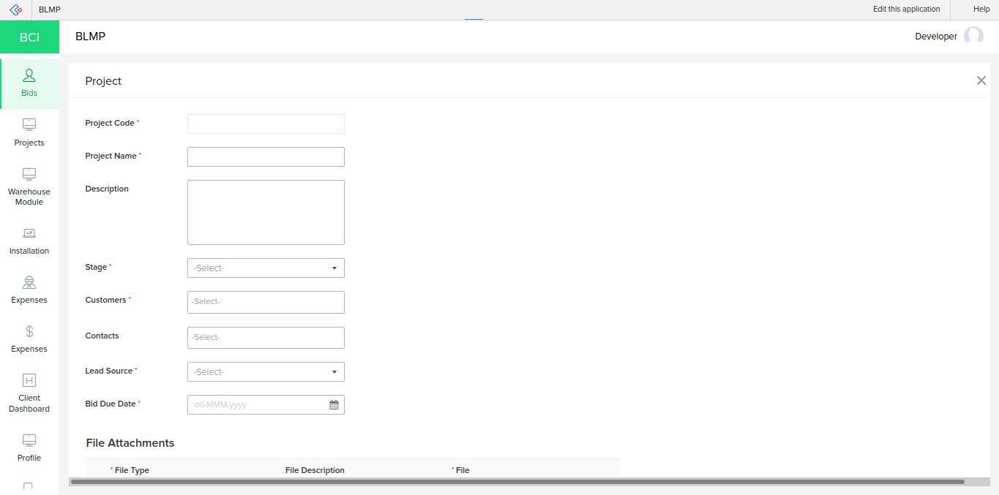
*Image 6: Bid Form.*

##### Bid Pricing

​        Bid pricing is a feature used in the application capture your bidding amount over a project/tender. We can also add estimate of pricing split-up of various expenses which you may have on various resources and services which are going to be offering to the customer as *Buy Amount* and *Sell Amount*. The page shown in *Image 15* will be shown immediately after a bid is created.  You can click on *Add Price Type* button to add a new price type into new or existing bid you have created. Form shown in *Image 16* will be opened to collect the price type, sub type and pricing information. While adding price types to a bid, new price type or sub type can be created from the bid from itself.

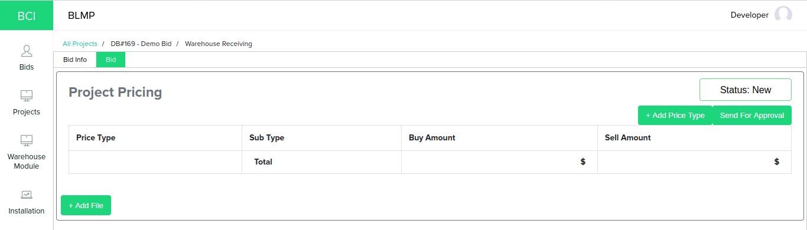
*Image 15: Bid Pricing Page*

​        

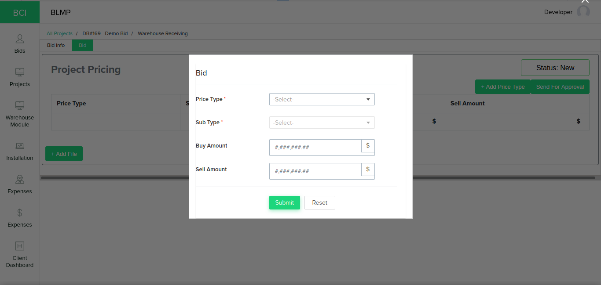
*Image 16: Adding Price Type Bid Pricing.*

​        Once the prices types are added to pricing Bid Pricing Page will looks like as shown in *Image 17*. We enable to option to delete or edit the price type added to the pricing when needed. We have also implemented a approval process for getting permission from user from higher hierarchy. We have discussed the approval process in details under [Bid Approval](#bid-approval) section.


*Image 17: Bid pricing page after adding some price type to the bid.*

##### Bid Approval

​        In bid approval process once bid pricing is completed, The bid can be sent for approval to based on hierarchy. In BLMP Application we have two hierarchy, Bid Creator and Bid Approver. Users under Bid Creator and Bid Approver both have access to create, edit and delete a price type in bid pricing process. But the Bid Approver have privilege to approve or review the bid pricing submitted by Bid Creator as shown in *Image 18*.

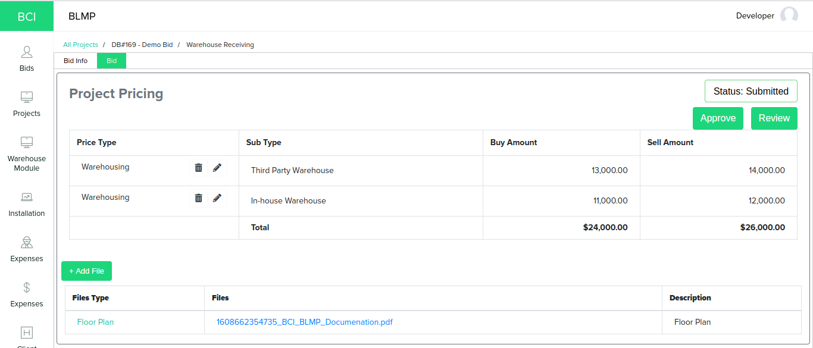
*Image 18: Bid Pricing after submitting for approval of Admin Approver*

​        You can notice in the status of *Bid Pricing* is update to *Submitted* from *New*. At this stage users in admin role will not have access to add, modify or delete a price type (i.e., Admin will only have read-only access once submitted for approval). Now users under Admin Approver role will access create, edit or delete access to price types added by Admin user. Apart from this they have privileged to *Approve* a pricing submitted or send it back for *Review* using the *Approve* or *Review* button shown in above *Image 18*.

​        If *Admin Approver* approves the pricing, the bid approval process will be completed and the bid pricing will be locked no more modification in pricing can be done by both the roles.

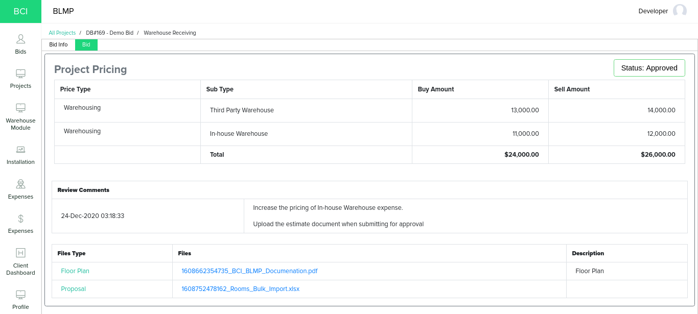
*Image 21: Approved pricing and Status updated to Approved*

​        If approver clicks on *Review* button, a window will prompt for *Review Comments* as shown in *Image 19*. Admin approver can adding review view in he rich text field and click on submit, Then status of the pricing will be updated to *Review* and Review Comment added by the approver will be shown to admin as shown in *Image 20*. At this stage pricing details can be revised or additional files can be attached by Admin and resubmit the pricing for approval again.

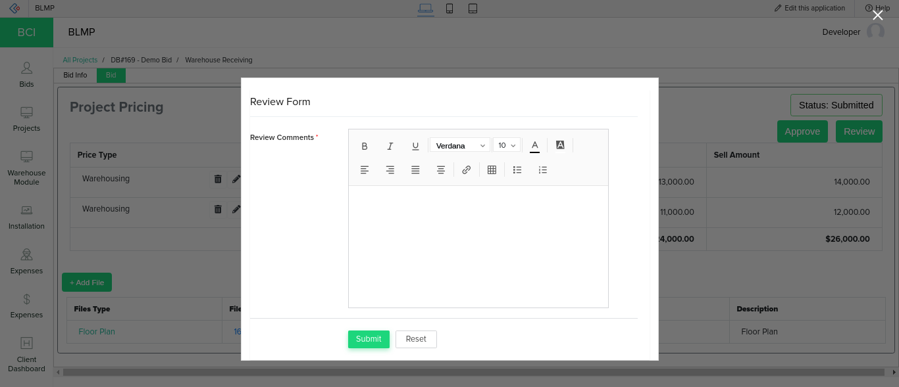
*Image 19: Rich-Text field to get review comment from approver*

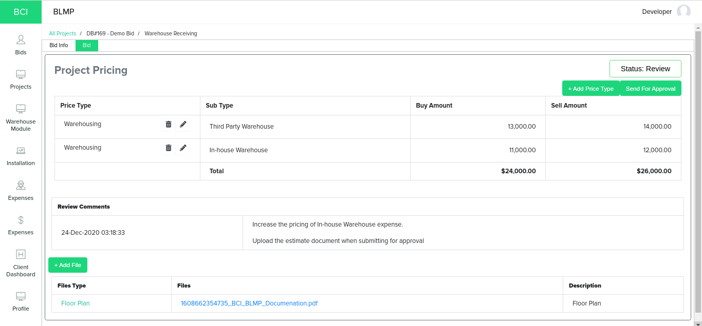
*Image 20: Status updated to Review and showing Review Comment added from Admin Approver*

##### Bid to Project Conversion

​        Once a Bid Pricing is approved and win, Bid created can be converted to project directly. You can go to *Bids &#129042; Approved &#129042; Edit* and update the *Stage* of bid to *Win*. Once the bid status is selected the application will show few more field like Project Owner, Employees, Hotel, Warehouse, etc as shown in *Image 21*. Once all those details where given you can click on submit to convert a Bid to a Project and wizard will be opened automatically get gather few more information to setup the project, We have covered this in detail in [Project Wizard](#project-wizard) section . Following are the field description of the project fields.

| Field Name       | Field Description                                                                                                         |
| ---------------- | ------------------------------------------------------------------------------------------------------------------------- |
| Project Owner    | BCI Employee who is going to be point of contact between BCI and Customer.                                                |
| Employees        | Employees with different roles involved in this project. Only user who needs application access is sufficient.            |
| Hotel            | A Hotel model needed to be created. Will holds the information of building and floor we are going to work on this project |
| Warehouse        | Warehouses going to be used in this project for storing he furnitures.                                                    |
| No of Rooms      | Number of rooms involved on this project                                                                                  |
| No of Room Types | Number of room types involved in this project.                                                                            |
*Table 1: Bid to Project Conversion additional field in Bid Form.*

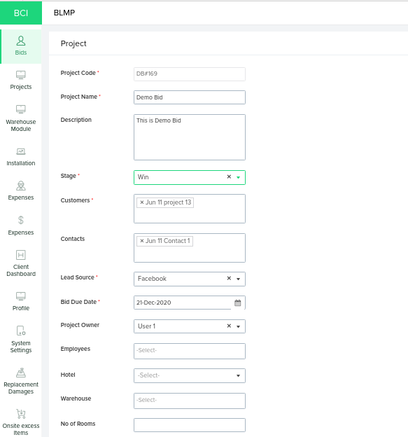
*Image 21: Bid to Project conversion form fields*

> ***FYI:*** *A project can also be created directly by setting the bid stage to **win** directly to avoid the bid approval process.*


#### Projects

##### All Project List
        
​       All Project List Report contains the details of projects that are created.To View a particular project click on *Select Project* button in the All project List report.
        
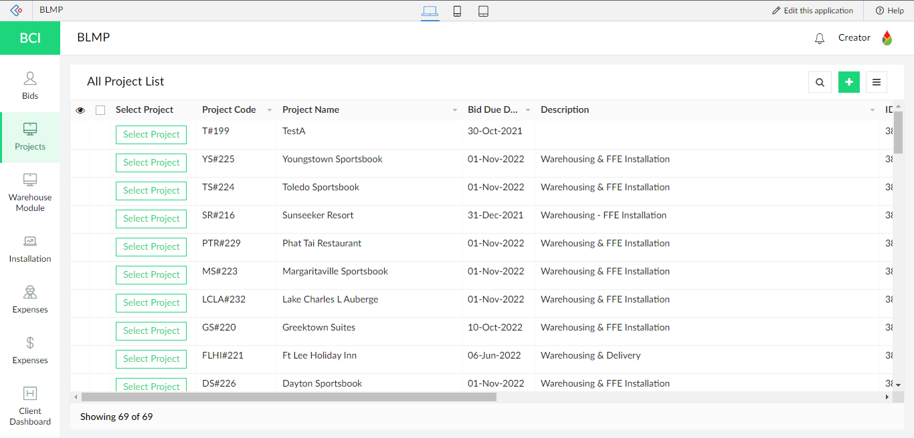
*Image 21-a: All Project List Report*

##### Project List

​       Project List report is specfic to every employees.This report contains the details project which are assaigned for a particular employee.To View a particluar project click on *Select Project* button in report.

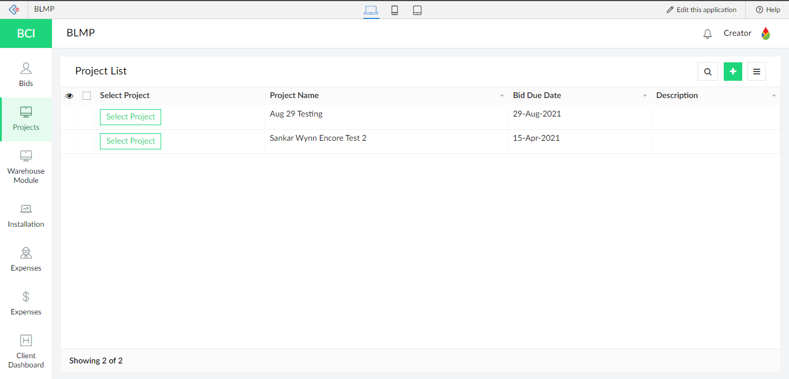
*Image 21-b:Project List Report*

##### Project Details

**Project Info**

​       Project info report contains details of particular project,the details includes Project Name,Customer name,Project owner,Lead Source,Closing Stage of the project and Stage of the project.It contains additional information such as Project Pricing,Weight and Project Profitablility.

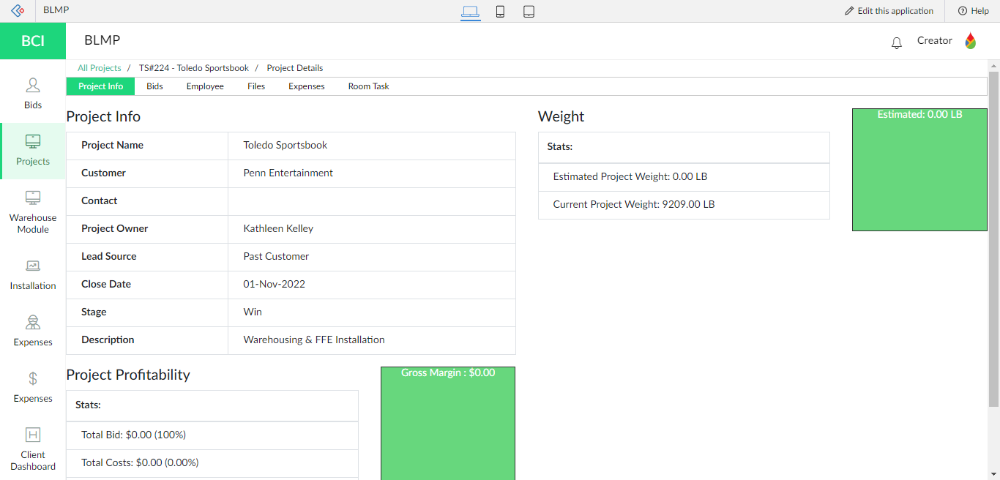
*Image 21-c: Detailed View of Project*

**Bids**

​       Bids contains information about the Pricing type,Sub type,Buy Amount,Sell Amount and Staus of the project.

**Employee**

​      Employee report contains the details of project that are assigned for a particular employee,and some other details such as Name of the employee and Role of the employee.

**Project Files**

​      Project Files contains details of files that are associated with a particular Project.

**Waiting for Accrual**

​      Waiting for Accrual report track the expenses of the project Such as expense type,Expense amount,and Accrue.

**Room Task**

​      Room Task report contains details rooms that are in present in currently selected project.Also two bars present on the top represents Installation completed percentage.Left bar represents the total number items installed for the current project,and the right bar represents installation completion status of total room present in project.

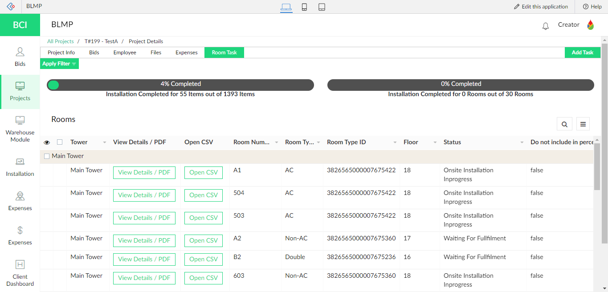
*Image 21-d: Room Task Report*


##### Hotel Details

**Furniture**

​		Furniture report contains details of furniture present in the current project.Furniture form is also used for uploading each furniture manually.For manully adding each furniture select *+Add Furniture* Button on Furniture report which is highlited in *Image 21-e* below.

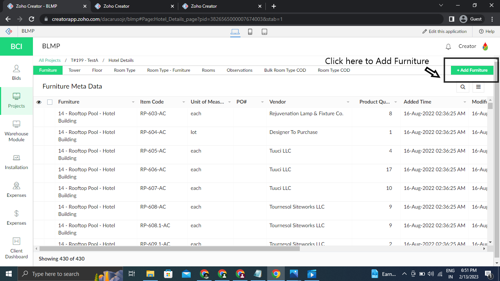
*Image 21-e:Furniture Report*

​		After selection Add Furniture button a form will be loaded will looks as shown in *Image 21-f*.Add Necesarry details of furniture such as Furniture,Item Code,Project Qty and Storeage type, After adding those details click on submit button.Then the furniture details will be adde in Furniture Report.

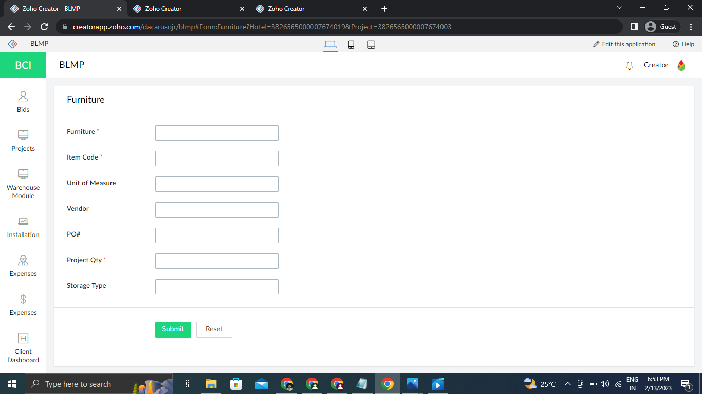
*Image 21-f:Furniture Report*


**Tower**

​		Tower Report contains details of tower that are present in the project.It contains details such as Tower name and Description.Also in this tower report you can manually add each tower details by selecting *+Add tower* button which is higlited in below mentioned *Image 21-g* .

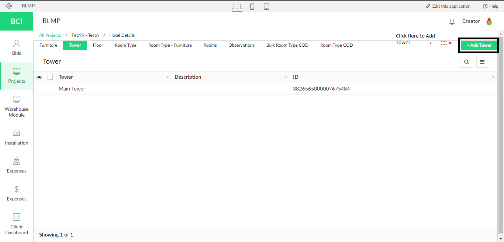
*Image 21-g:Tower Report*

​		After selection add tower option , a small dialogue box appears will looks as shown in *Image 21-h*,where you can enter the  details of the tower which you are going create.After entering all details click on submit button.Added tower details will get uploaded in Tower report.

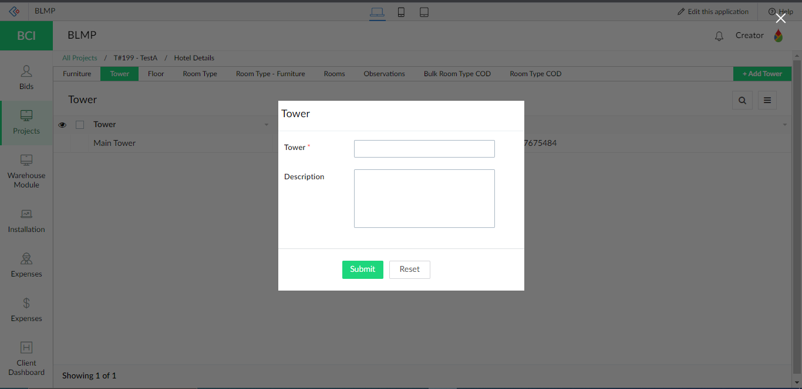
*Image 21-h:Add Tower Report*

**Floor**

​		Floor report contains the details of Floors that are present in the Project.Floor report is also used to uploading each floor data manually.For each adding each floor to the report,Click on *+Add Floor* button on the floor report as mentioned in the *image 21-i*  below.

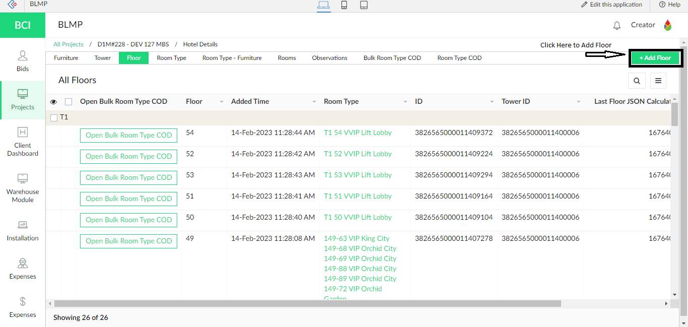
*Image 21-i:Floor Report*

​		After selecting Add floor button,a small dialogue box will appear on *image 21-j* ,on that form add the details of floor that you are going to create.after entering all the details click on submit button.Added floor details will get reflected on Floor report.

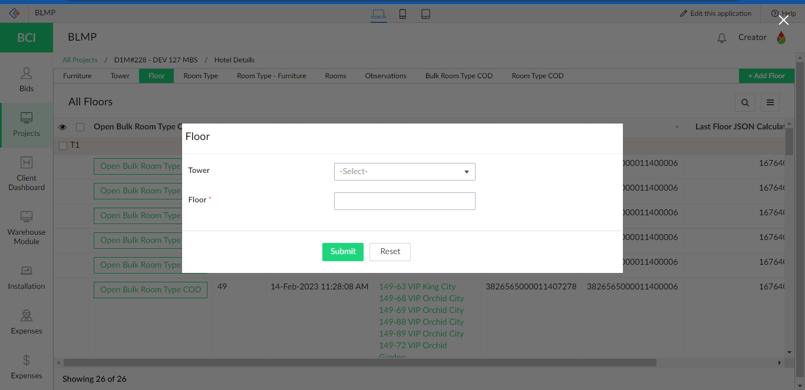
*Image 21-j:Add Floor Report*

**Room Type**

​		This report contains the details of Room type details.you can add Room type record manually by Selecting *+Add Room Type* button on the Room type report as mentioned in the *image 21-k*  below.

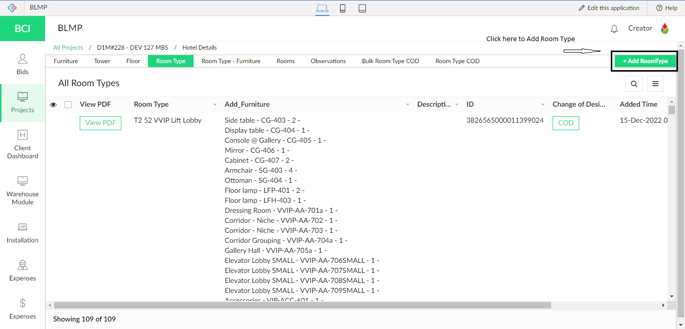
*Image 21-k:Room Type Report*

​		A new form will get loaded as shown in *image 21-l* for adding Room Type record.Enter all necessary details such as Room Type,description,Furniture and Quantity.After entering all the details click on submit button,After submitting the record added room type details will get reflected on Room type report. 

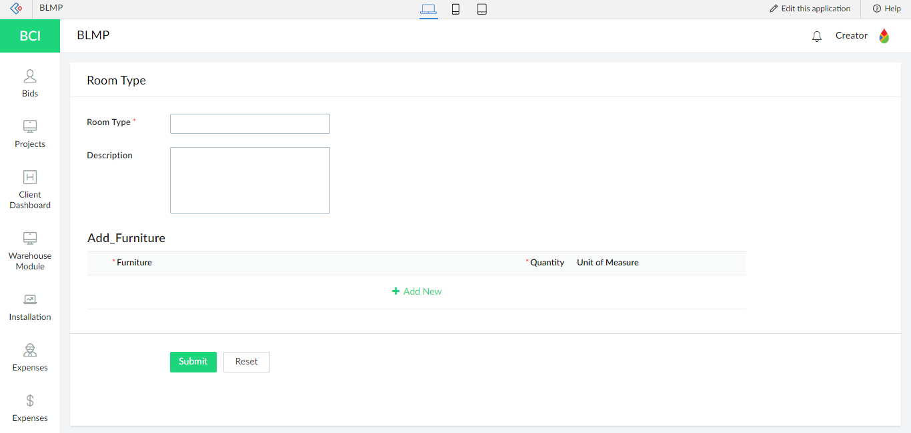
*Image 21-l:Room Type Add Report*

 ​     For Changing the design of room type for single room type,click on the *COD* button as mentioned in the below *image 21-m* .
 
 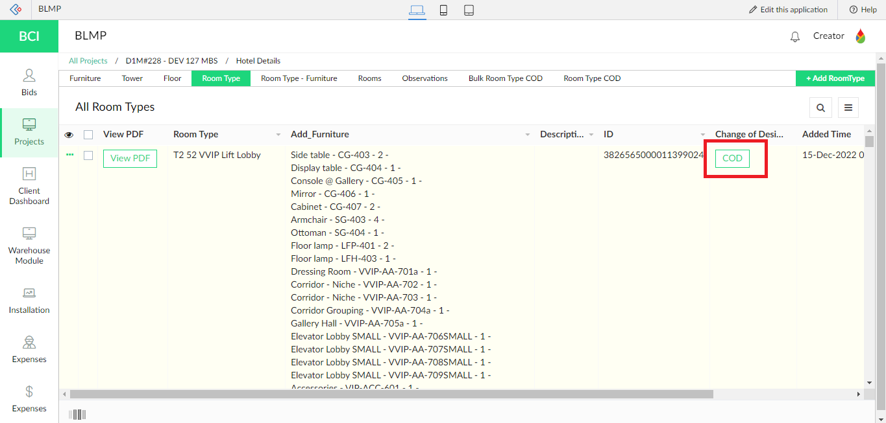
   *Image 21-m:Changes for Single COD Report*
 
 ​     After selection the COD button, a new form will get loaded as shown in *Image 21-n* for chagind the design for Room type.There are two process for changing the design of the room , they are *Adjustment Existing Furniture* and *Add new furniture*, after selecting the process fill all the necessary fileds such as furniture,No of Furniture and adjustment etc.After entering all the details click on submit button.Room type design will be changed for that particular room type.
 
 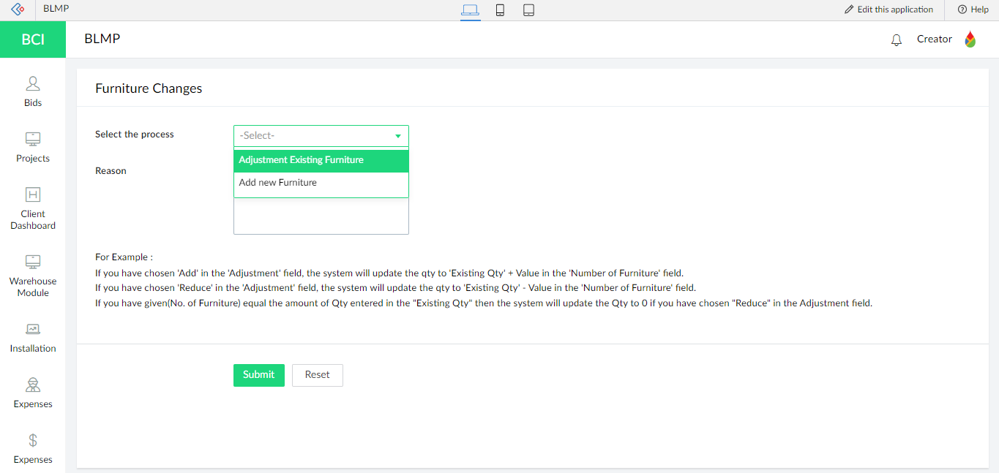
  *Image 21-n:Single COD Report*
 
 ​     For Changing the design of room type for *Multiple Room Type*,Select all Room type records that you want to change design,after selecting the required room type,Click on the *Bulk COD* button which is mentioned in the *image 21-o*  below.After clicking on *Bulk COD* button,a new form will get loaded will look as shown in the image.
 
 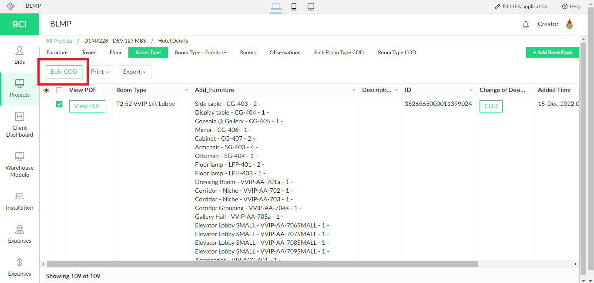
   *Image 21-o:Changes for Bulk COD Report*
   
​     There are two process for changing the design of the room as shown in *image 21-p*, they are *Adjustment Existing Furniture* and *Add new furniture*, after selecting the process fill all the necessary fileds such as furniture,No of Furniture and adjustment etc.After entering all the details click on submit button.Room type design will be changed for that particular room type.

 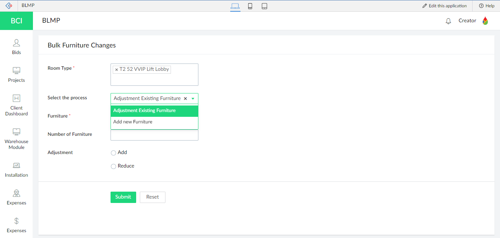
  *Image 21-p:Bulk COD Report*

​     Room Type Records Shows the detials of furniture details for a particular room type,For viewing only furniture details you can check *Room type - Furniture* Report which shown in the *image 21-q* below.

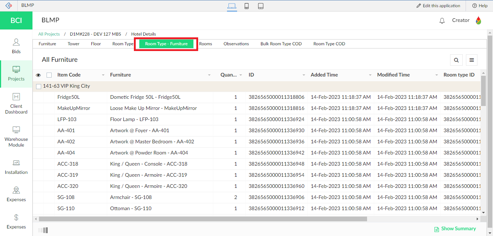
  *Image 21-q:Room Type Furniture Report*

​     *Bulk Room Type COD* and *Room Type COD* items report are present in Report which is highlighted in *image 21-r* below.

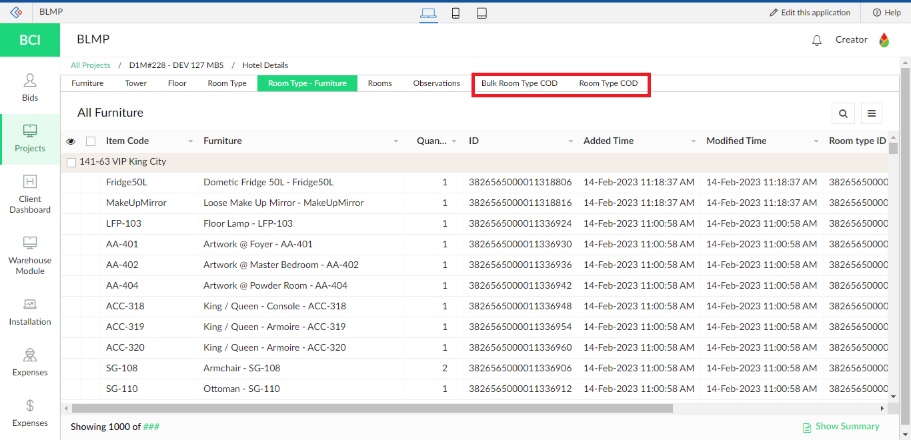
  *Image 21-r:Single & Bulk COD Report*

**Rooms**

​		Rooms Report contains the details of Rooms that are present in Project.For Adding each room manually click on *+Add Room* Button on the report as mentioned in the *image 21-1* below.

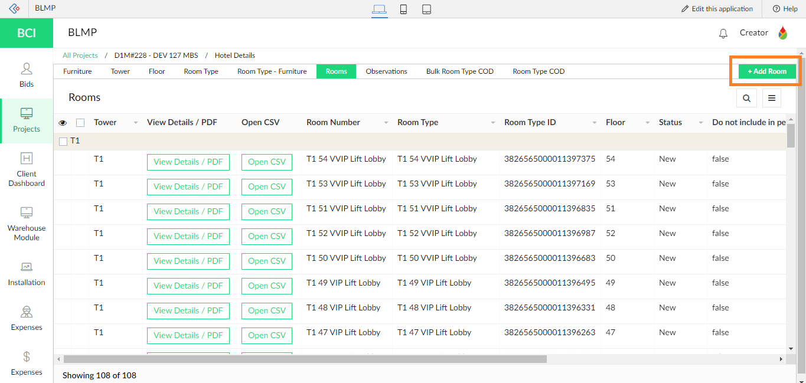
 *Image 21-1:Add Room Button*

​		Aftert selecting add room button,a new form will get loaded which will look as shown in the *image 21-2* .Please fill all the details such as Buliding,Room type,Floor details,Room Number.After entering all the details click on submit button.Then this rooms will get added in Rooms Report.

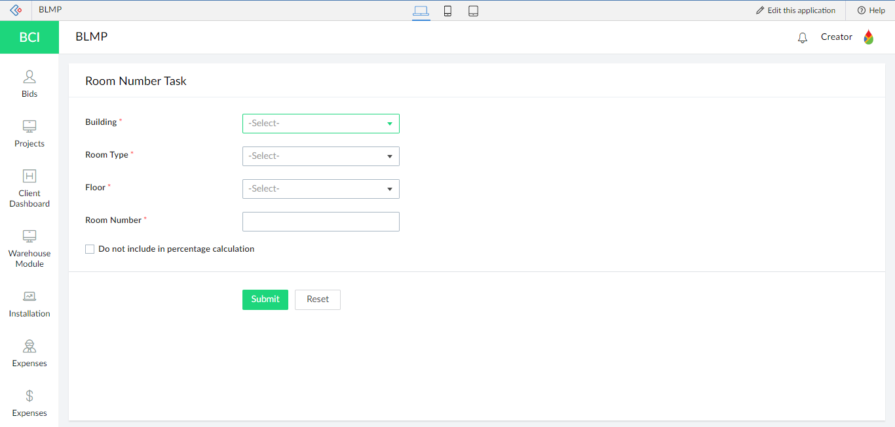
 *Image 21-2:Add Room Report*

​		For Changing the room type for multiple record,Select the records that room type need to changed,After selecting required records click on *Change room type* button as mentioned in the *image 21-3* below.

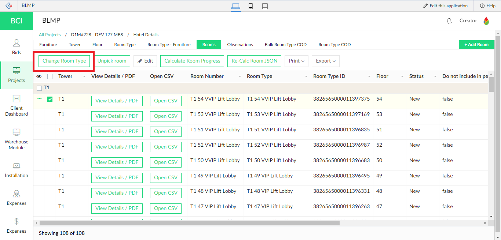
 *Image 21-3: Change Room Type Button *

​		After clicking on *change room type* button,a new form will get loaded will look as shown in the *image 21-4* .Enter details of Adjust room type and click on submit button.After Clicking on submit button the changes will be made for all the selected rooms.

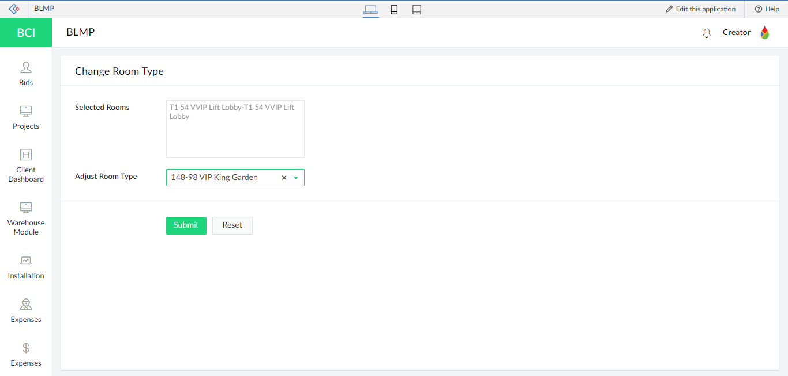
 *Image 21-4: Change Room Type Report *


​		For Unpicking rooms for Mulitple records,Select the records that needs to be unpicked,After selecting required records click on *Unpick Room* button as mentioned in the *image 21-5* below.After clicking on *Unpick Room* button.All Furniture in the room will be unpicked for the selected records.

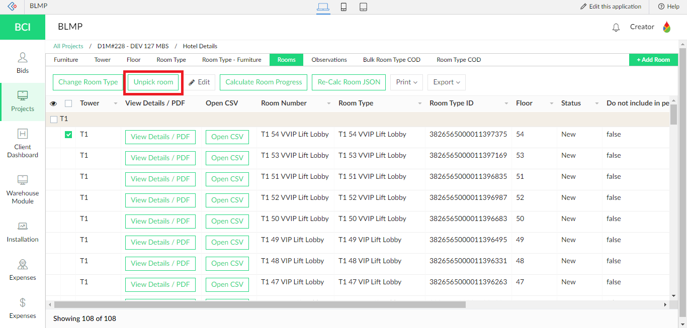
 *Image 21-5: Unpick Room Button*
      
##### Project Wizard

        Once [Bid to Project Conversion](#bid-to-project-conversion) is completed the project wizard for will be opened automatically to collect some more information regarding the project like *Furnitures, Rooms Types* and *Rooms*, Which will guide users thought the process of setting up the project in application. A project wizard will looks as shown in *Image 22*. In this wizard you can find options to bulk import details into the application.

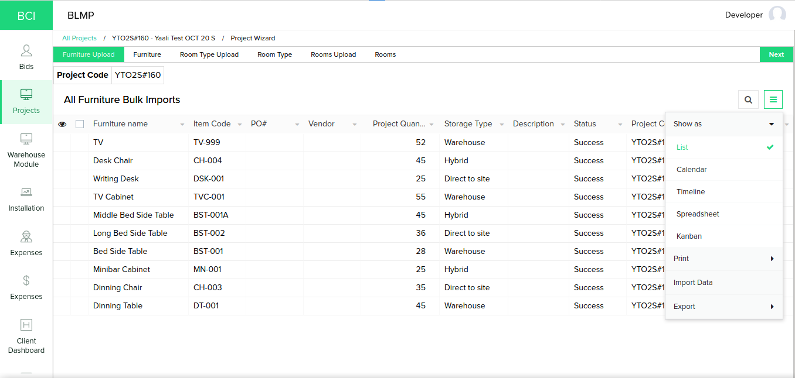

*Image 22: Furniture Upload - Project Wizard.*

**Furniture Upload**

[Furniture Import Template](https://docs.zoho.com/downloaddoc.do?docId=j75urd5cae0ae615542468509e24c421a7da5&docExtn=xlsx)

​		*Furniture Upload* tab will allow you to upload/import furniture into a project. You can use the *Import Data* feature available in the report shown in *Image 22*. For import the data into this report data should be available as a CSV (Comma Separated Values), XLS or XLSX format with following columns listed in the following *Table 2*.

| Column Name      | Data Type | Description                                                  | Mandatory | Unique |
| ---------------- | --------- | ------------------------------------------------------------ | --------- | ------ |
| Project Code     | String    | Unique project ID assigned to a project you are currently working on. <br />**Note:** Each furniture row in the sheet should have project code value. | True      | False  |
| Furniture name   | String    | Name of the furniture you have importing into project.       | True      | False  |
| Item Code        | String    | Unique furniture code of all furnitures you are importing into application. <br />***Note:*** Case Sensitive. | True      | True   |
| Description      | String    | Detailed description of the furniture                        | False     | False  |
| PO#              | String    | You can adding the PO number from which you expect to receive this furniture. | False     | False  |
| Vendor           | String    | Name of the furniture vendor.                                | False     | False  |
| Project Quantity | Number    | Quantity of the given furniture needed for this project.     | True      | False  |
| Storage Type     | String    | Storage Type                                                 | False     | False  |
*Table 2: Furniture upload data column description.*

**Room Type Upload**

[Room Types Import Template](https://docs.zoho.com/downloaddoc.do?docId=j75urc8eca11b2ced459097448aa255e1be00&docExtn=xlsx)

​		*Room Type Upload* tab will allow you to upload/import type of rooms into a project.You can use *Import Data* feature for import/upload room type details into your project.For import the data into this report data should be available as a CSV (Comma Separated Values), XLS or XLSX format with following columns listed in the following *Table 3*.

| Column Name      | Data Type | Description                                                  | Mandatory | Unique |
| ---------------- | --------- | ------------------------------------------------------------ | --------- | ------ |
| Project Code     | String    | Unique project ID assigned to a project you are currently working on. <br />**Note:** Each room type row in the sheet should have project code value.  | True      | False  |
| Room Type        | String    | Type of room you have to add to your project                 | True      | False  |
| Furniture Item Code   | String    | Furniture item code you are importing into application  | False     | False  |
| Description      | String    | Detailed description of the furniture                        | False     | False  |
| Quantity         | Number    | No of Furniture required for that room                       | False     | False   |
*Table 3: Room type upload data column description.*

**Room Upload**

[Rooms Import Template](https://docs.zoho.com/downloaddoc.do?docId=j75ur2b031e94e8ee4ab38167abd36367d5a9&docExtn=xlsx)

​		*Room Upload* tab will allow you to upload/import Rooms into a project.You can use *Import Data* feature for import/upload room type details into your project.For import the data into this report data should be available as a CSV (Comma Separated Values), XLS or XLSX format with following columns listed in the following *Table 4*.

| Column Name      | Data Type | Description                                                  | Mandatory | Unique |
| ---------------- | --------- | ------------------------------------------------------------ | --------- | ------ |
| Project Code     | String    | Unique project ID assigned to a project you are currently working on. <br />**Note:** Each room row in the sheet should have project code value.  | False      | False  |
| Tower            | String    | Tower details where the room is located.                     | Fasle      | False |      
| Floor            | String    | Floor Number for the room.                                   | Fasle      | False | 
| Room Type        | String    | Room type details for the room                               | Fasle      | False |  
| Room No          | String    | Room No details for the room.                                | Fasle      | True  |
*Table 3: Room type upload data column description.*


> ***Note:*** *In BLMP application, If a furniture, room type or room created or imported to a project it will associate with that project only. This furniture, room type or room will not be accessible from other project in the application. Though, User have access to multiple project in the application.*


##### Project Details

##### Hotel Details


#### Warehouse Module

​		Warehouse module in BLMP application is used to manage various operations performed in within warehouse and reports which helps to maintain the inventory furnitures which moves in and out of warehouse. This module have various features like Picking, Pulling, Exception, Inventory, Floor wise shortage and Room wise shortage reports. We have covered these features in detail in this section. 

##### Warehouse Locations

​		Warehouse Location is report will have list of warehouse we have used in various projects in this application. To add a new warehouse to the application, we need to provide some basic details like Address, Phone, Email and also need to assign a employee from employee list as in-charge of warehouse. These details will be later be used in the application. User are allowed to create or edit a warehouse in the application. Deleting a warehouse is not permitted, because this will break the relation between records if some records where created with that warehouse.

​		User can access the *Warehouse Locations* from *Warehouse Module &#129042; Warehouse Locations*. The report will open as show in *Image 23*.

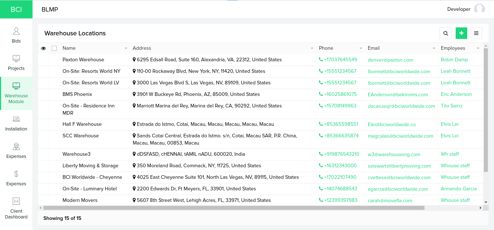

*Image 23: Warehouse Locations report in the warehouse module.* 


##### Receiving

​		Receiving module is use to receive furnitures into warehouse in form of Deliver Notes (DN). A delivery can be created  in receiving in order to receive those item into receive those item into warehouse inventory. You can start the receiving process by creating a DN from *Warehouse Module &#129042; Receiving &#129042; Click on Create DN* as shown in the *Image 24*, Once the button is click form shown in *Image 25* will be opened to collect information regarding DN.
 

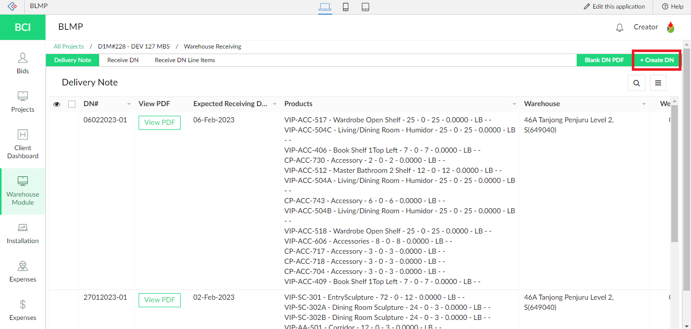

*Image 24: Receiving Page - Delivery Note List View.*

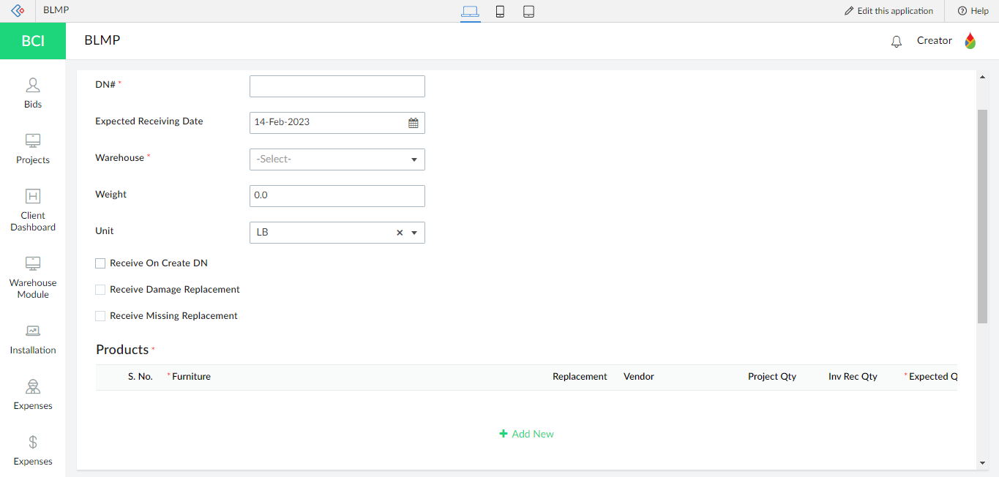

*Image 25: DN Creation Form.*

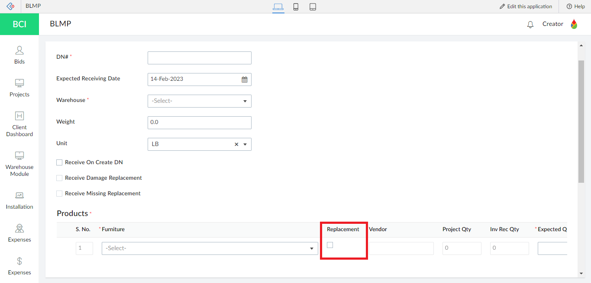

*Image 25-1 : Replacement Field in DN Creation form *

**Create DN:**

​		DN from will collect informations like DN number, Expected Deliver Date, Warehouse and Products list. Warehouse field in the DN allows the system to know to which warehouse these item should be received. We have also given another two options in the DN form, those are *Receive On Create DN* and *Receive Damage Replacement*. If *Receive On Create DN* check box is ticked during DN creation, the receiving of the DN will also be completed at same time. If *DN Creation Form* is submitted without selecting the *Receive On Create DN* this DN will be available for receiving later in Receive DN tab. If *Receive Damage Replacement* check box is ticked, system will allow to receive replacements for damage reported in *Damage Management* or *Exceptions*.

​	In *Products* sub-from you can select furniture you expecting to receive in the DN. The *Furniture* field will list all furnitures you have imported / created in [Project Wizard](#project-wizard). If the furniture you would like to adding is not listed, the furniture should be added from [*Project Wizard*](#project-wizard) or [*Hotel Details*](#hotel-details) page first.

​		For Creating a DN for a Replacement Item,Click on *Replacement* in Product Sub-form shown in the *Image 25-1*.

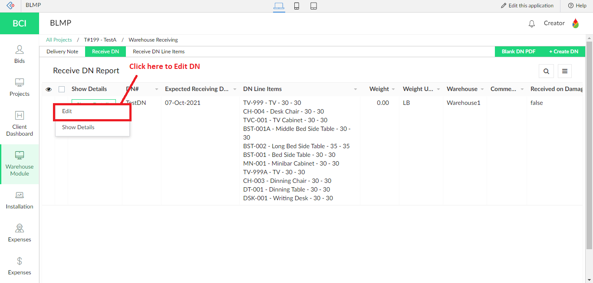

*Image 26: Receive DN Page.*

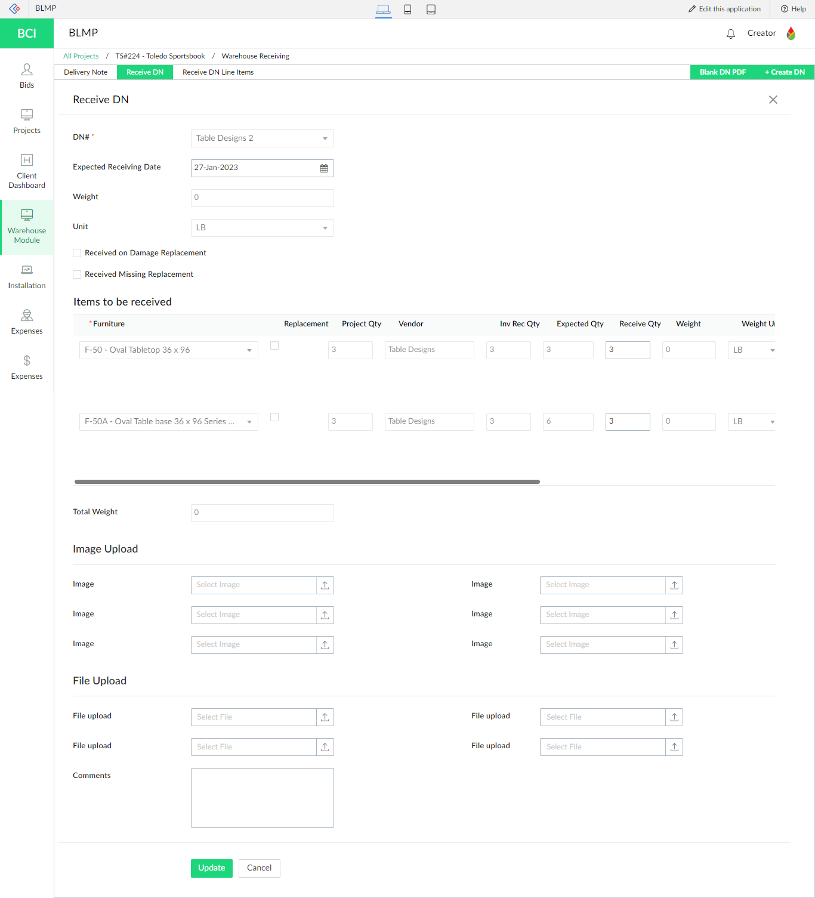

*Image 27: Receive DN form.*

**Receive DN:**

​		In *Receive DN* from shown in *Image 27* is similar to *DN form*. In the *Item to be received* sub-form it will show Expected furniture quantity added in *Create DN* form, Apart from this you can find two other field called *Receive Qty* and *Warehouse Location*.  The *Receive Qty* field hold quantity of the furniture received to warehouse over *Expected Qty*. The *Warehouse Location* field is to store details where the received product is stored with in the Warehouse. This details will later be usefully during [Pulling](#pulling) process and also shown in [Inventory](#inventory). Once the *Receive Qty* and *Warehouse Location* is given you can upload some image and files relevant to this receiving process and click on submit, System will then increase the received quantity in respective warehouse inventory. 

​		For Editing Qty in any Deliver Note,Fisrt you have to reduce the *Receive Qty* (Shown in *Image 27 -1)* in Receive DN.Also Note that if you want to reduce a particular qty,that overall available qty must be greater than (or) equal to reducing Qty.Then Only we can able to reduce Qty in Receive DN.After chaning Qty in Receive DN ,you have change the *Expected Qty* (Shown in *image 27-2*) in Delivery Note Report.

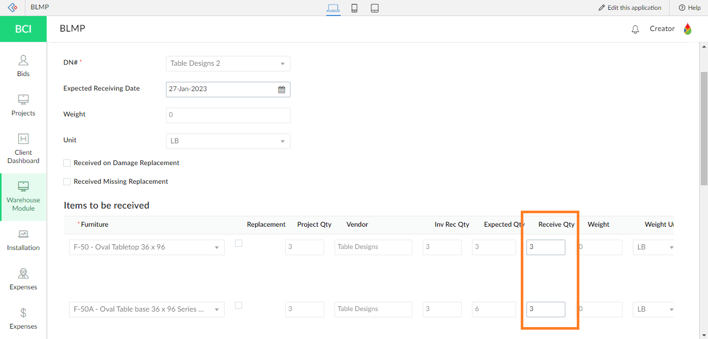
*Image 27-1 : Receive DN - Receive Qty*

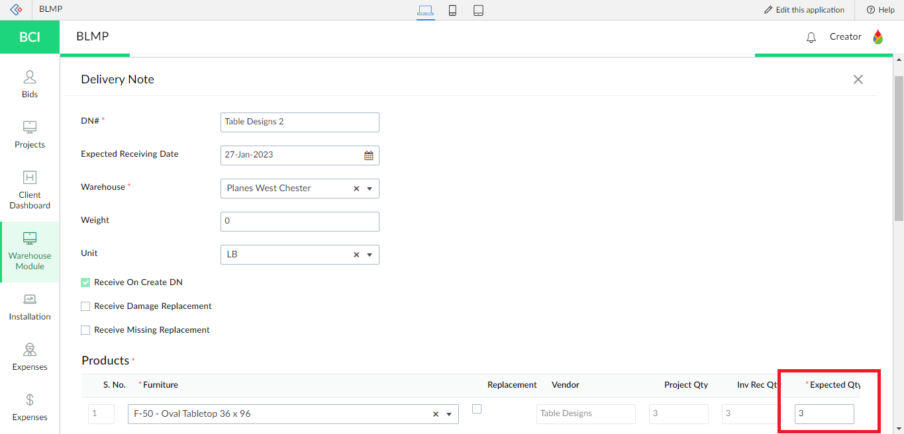
*Image 27-2 : Create DN - Expected Qty*


**Receive DN Line Items**

​		Receive DN Line Items Report Contains the details of Furniture items that are received for all Delivery notes.Receive DN Line Items Report loosk as shown in the *Image 27-3*.

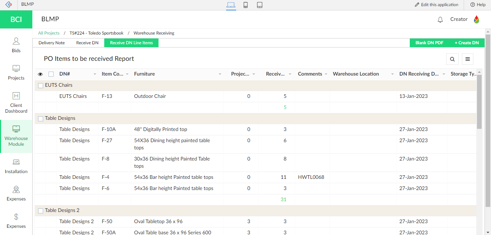
*Image 27-3 : Receive DN Line Items*

##### Picking

​		Picking process can be used by Project Managers or Project Coordinator to create a pick-list for the room they have planned to install. In our system we have option to pick multiple rooms at a time. They have start the picking by selecting one or more rooms to be picked from *Warehouse Module &rarr; Picking &rarr; Pick* as shown in *Image 31* and click on *Bulk Pick* button which will open a pre-populated form as shown *Image 32*. This *Bulk Pick Form* will having some basic information regarding picking process like Unique ID, Picking Date and Time, Floors, Rooms, Room Types and Warehouse in which is picking is done. The *Furniture* sub-from will have list of furnitures needed to be picked for selected room according to room types you have import in [Project Wizard](#project-wizard), This sub-from also shown and collect information which are listed in following *Table 3*.

| Column Name               | Description                                                  |
| ------------------------- | ------------------------------------------------------------ |
| Furniture                 | This column shows list of furnitures needed to be picked for fulfilling selected rooms based on room types import in [Project Wizard](#project-wizard). |
| Total Qty Required        | Actually needed quantity of furniture needed to be installed in selected while creating *Bulk Pick*. |
| Already Picked            | Quantity of furniture already picked for fulfilling selected rooms. |
| Remaining Qty             | Number of quantity out of *Total Qty Required* needed to be picked yet to completely fulfill selected rooms. |
| Inventory (Stock In Hand) | This column shown *Stock In Hand* quantity of given furniture in warehouse you have selected in *Warehouse* field. |
| Pick Qty                  | User can input the quantity they would like to pick from the inventory. User are allowed to pick less than or equal to *Remaining Qty* during the picking process. |
| DN#                       | List of DN in which given item is received into selected warehouse in [Receiving](#receiving) process. |
| Warehouse Location        | List out warehouse locations added while receiving the furnitures into warehouse in [Receiving](#receiving) process. |
*Table 3: Furnitures sub-form field description in picking process.*

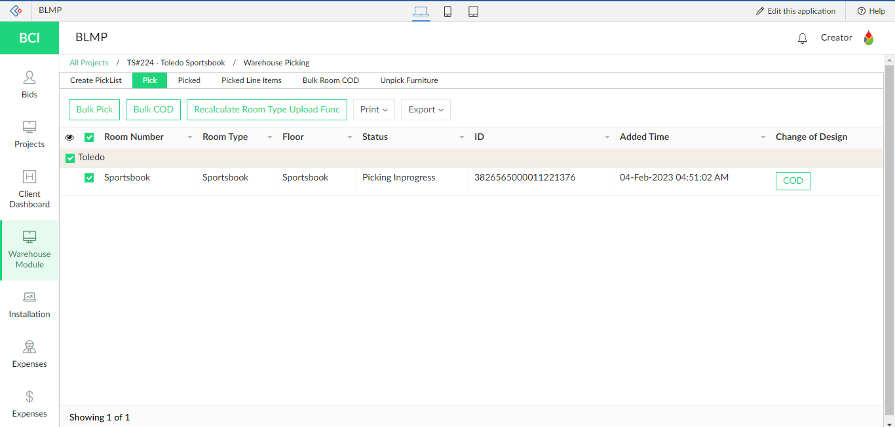
*Image 31: Picking room to be picked.*

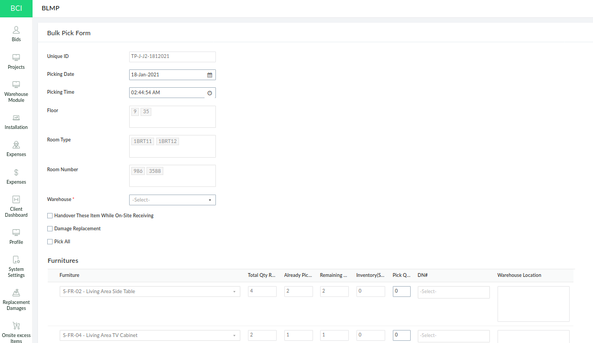
*Image 32: Picking form for rooms selected in Image 31.*

​		In picking process we have also given four options, Option to mark a pick-list as *Handover These Item While On-Site Receiving,Damage Replacement,Missing Items,Pick ALl* as shown in *Image 31-1*.Please select any one of these as per your preference.when *Pick All* check box is ticked,It will pick all remaining Qty required for that project.

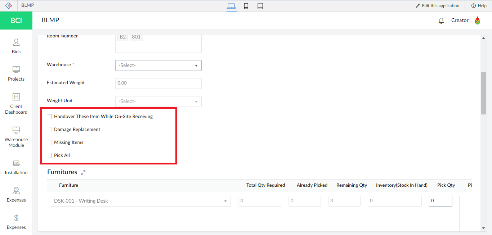
*Image 32-1 :Check Box in Bulk Pick Form *

​		After entering all the details in Bulk Pick Form,You have to Tick the check box as shown in *Image 31-2*,So that all enterd details will get reflected in [Picked](#picked).

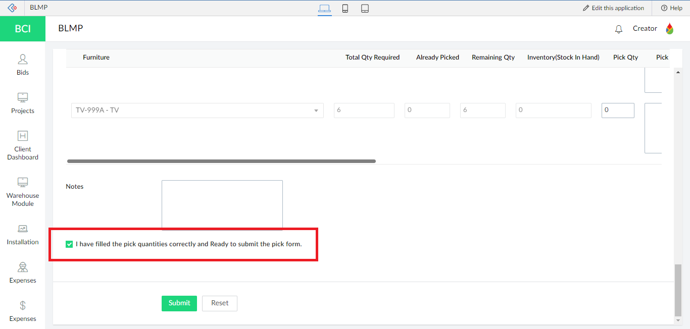
*Image 31-2 : Verification Check box*

​		Once the picking form is field with needed *Pick Qty*, the form can be submitted which in turn reduces the inventory level based on given *Pick Qty* in respective furniture and warehouse accordingly to make to no item is double picked (i.e., Picking same item more than once) during the picking process. Now this pick-list will be available for pulling in [Pulling](#pulling) process.  

​		For Changing the Design for single room Click on *COD* Button on Pick form Report which is shown in *Image 32-1*.

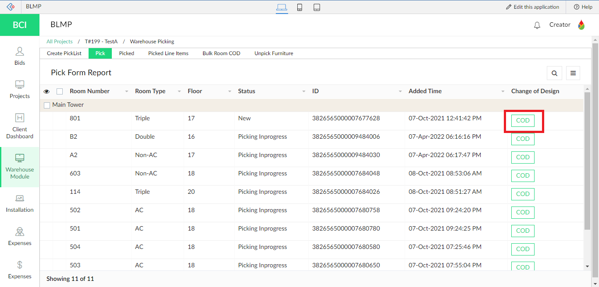
*Image 32-1 : COD Button on Pick format report*

​		After Clicking on *COD* Button,A new form will get loaded which will looks as shown in *Image 32-2*.Fill all the Details such as Process.Furniture,Name of Furniture and reason.After entering all the details click on submit button.These details will get uploaded report.


*Image 32-2 : COD Report*

​		For Changing the Design for multiple room,Select records that design need to be changed,Then Click on *Bulk COD* Button on Pick form Report which is shown in *Image 32-3*.

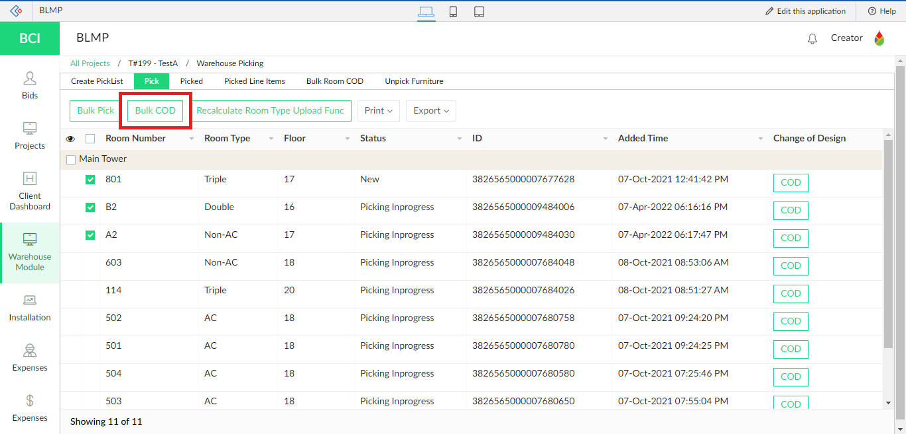
*Image 32-3 :Bulk COD Button on Pick format report*

​		After Clicking on *Bulk COD* Button,A new form will get loaded which will looks as shown in *Image 32-4*.Fill all the Details such as Room type,Name of Furniture adn adjustmnet type.After entering all the details click on submit button.These details will get uploaded report.

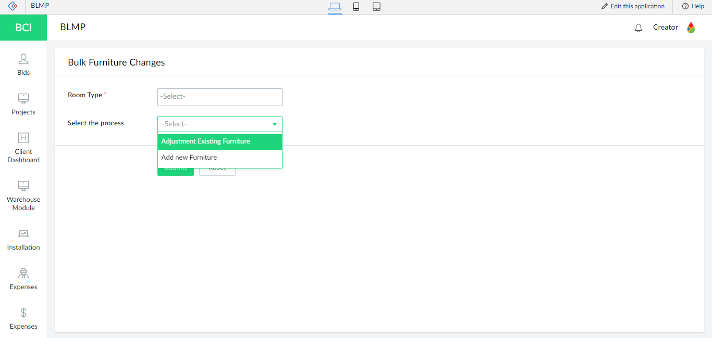
*Image 32-4 :Bulk COD Report*

​		You can also view Bulk updated COD Report in Bulk Room COD Section in the below mentioned *Image32-5*.

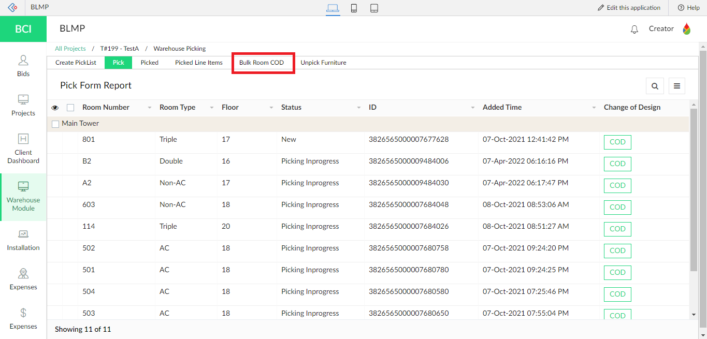
*Image 32-5 :Bulk COD Report*

##### Picked

​		Picked Report contains the details items that are picked for a particular project.For Unpicking Furniture a single room,click on *unpick furniture* button shown in *Image 32-4*.

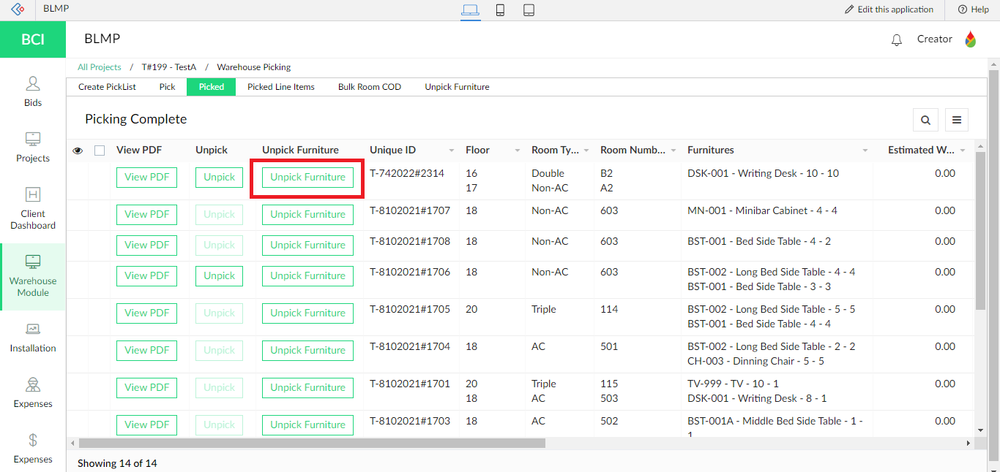
*Image 32-4 : Unpick Button in Picked Report*

​		After Clicking on *unpick furniture* , a new dialogue box will appear,as shown in *Image 32-5*,Fill all the details such as Room Number,Select furniture and unpicked Qty.After entering all the details click on Submit button.After that these added changes will get reflected into the project.

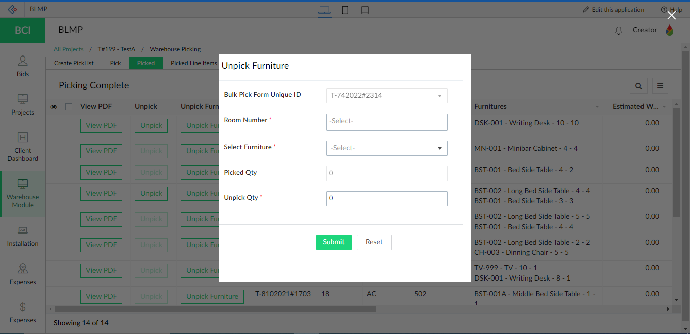
*Image 32-5 : Unpick Furniture Report*

​		For Unpicking all the items in a particular record, Click on Unpick button mentioned in the below *Image a*.After click on the button all the items will get unpicked.

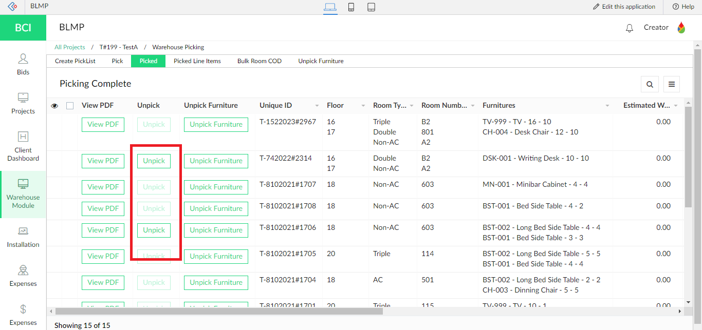
*Image a : Unpick Button*


​		You can also view unpicked furniture report in Unpick furniture as shown in *Image 32-6*.

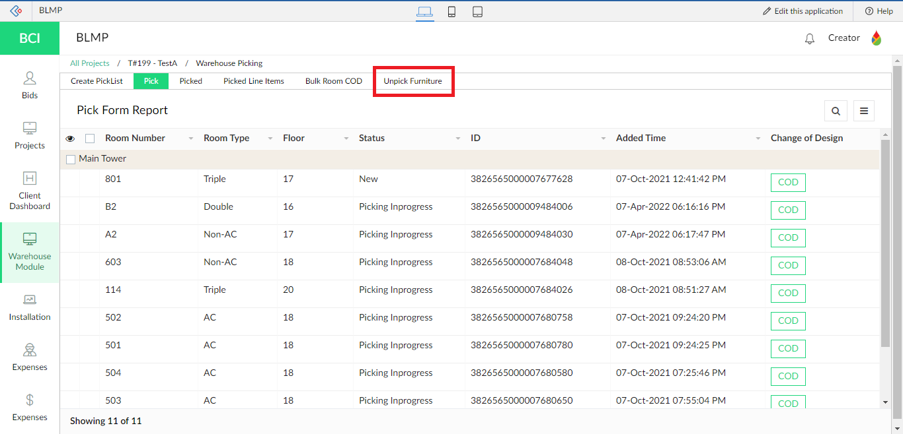
*Image 32-6 : Unpick Furniture Report*

##### Pulling

​		Pulling process can be used by *Warehouse Manager* and *Warehouse Staff* to pull needful items from the warehouse physically from warehouse based on pick-list created by *Project Manager* or *Project Coordinator* in [Picking](#picking) process. User can access the Pull-Sheets from *Warehouse Module &rarr; Pulling &rarr; Create Pull-Sheet* list will be opened as shown in *Image 33*. All pick-lists created picking process will be listed under *Create Pull-Sheet* tab, User a select a pick-list and click on *Edit* start the pulling process, Once the *Edit* option is clicked a pre-populated form with furnitures picked in *Picking Process* will be listed with respective pick quantity given in previous stage will be opened as shown in *Image 34*.

##### 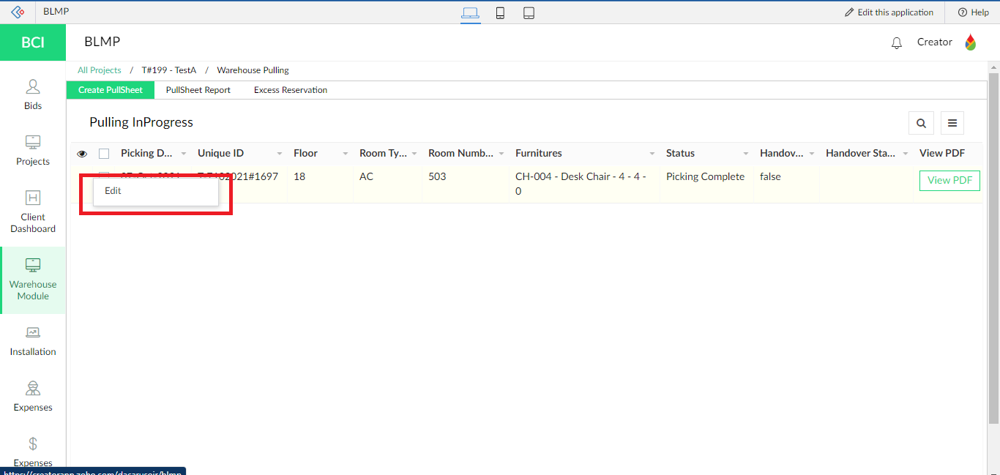

*Image 33: List of Pick-Lists created in Picking Process.*

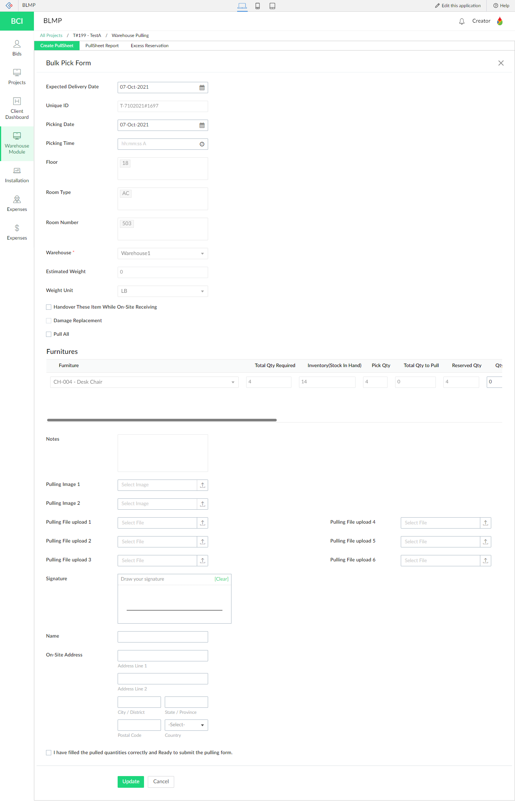

*Image 34: Pull-sheet Form.*

​		The pulling form will be pre-populated with information added while creating pick list like Floor, Rooms, Room Type and Warehouse in read-only mode. Furnitures sub-from will have list of furnitures which was picked during *Picking* process and also it has *Picked Qty* to show number for furnitures needed to be pulled from warehouse physically by warehouse people. Furnitures sub-from also shown and collect information which are listed in following *Table 4*.

| Column Name               | Description                                                  |
| ------------------------- | ------------------------------------------------------------ |
| Furniture                 | This column shows list of furnitures needed to be picked for fulfilling selected rooms based on room types import in [Project Wizard](#project-wizard). |
| Total Qty Required        | Actually needed quantity of furniture needed to be installed in selected while creating *Bulk Pick*. |
| Inventory (Stock In Hand) | This column shown *Stock In Hand* quantity of given furniture in warehouse you have selected in *Warehouse* field. |
| Pick Qty                  | Quantity of furniture needed to pulled from warehouse for fulfilling the rooms selected during picking process. |
| Qty Pulled                | Actual quantity of furniture pulled by warehouse by warehouse member. *Qty Pulled* can't be less than *Pick Qty*, But can be greater than or equal to *Pick Qty*. <br /><br />Users are allowed to pull more than *Pick Qty* because, In some cases some furnitures can be shipped as box with two or more item in a box as a set. Which can not be unboxed in warehouse to fulfill exact *Pick Qty*. In this case this option can be used, A proper *Notes* should be provided in order to send more than the actual *Pick Qty.* |
| DN#                       | List of DN in which given item is received into selected warehouse in [Receiving](#receiving) process. |
| Warehouse Location        | List out warehouse locations added while receiving the furnitures into warehouse in [Receiving](#receiving) process. |
| Notes                     | Notes field can be used to store some information or pass some information to next stage of the process. For example: Notes column is mandatory if you are pulling more than *Pick Qty*, So reason why *Qty Pulled* is greater than *Pick Qty should be given in notes field in order to submit the form. |

*Table 4: Furnitures sub-form field description in picking process.*

​		In the pulling process also it is possible to mark a picking as *Handover These Item While On-Site Receiving* though this option was not checked during the picking process. Pulling form will also have fields to upload images and files, which will be useful to attach image furniture they pulled from warehouse and any documents related to pulling process in the pull-sheet it self if needed.

​		In Bulk Pick there are three check Boxes available that are *Hand Over These Items while On-site Receiving,Damage Replacement,Pull All*(as shown in *Image-b)*,Click the required check box.Pull All Check box will automatically fill *Qty Pulled* based on Total Qty Required.

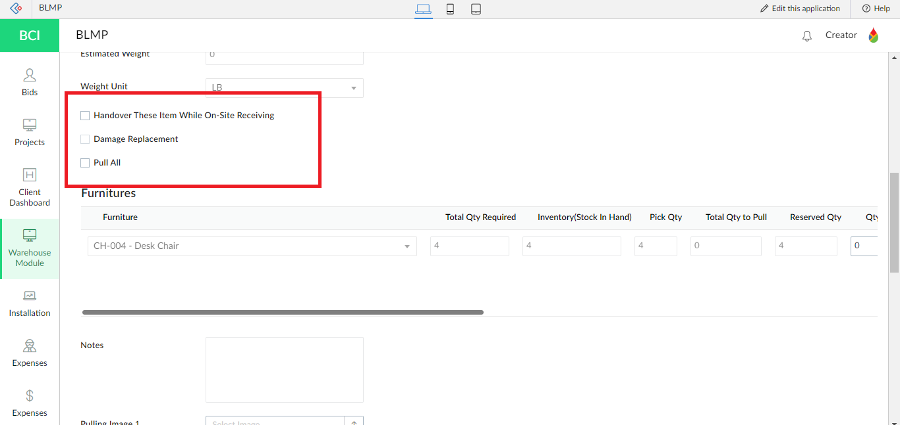
*Image b : Check Box for Pull*

​		After entering all the details for pulling,check the tick box shown in the *Image c*,You have click on Check box befor submitting,then only you changes will get submitted.

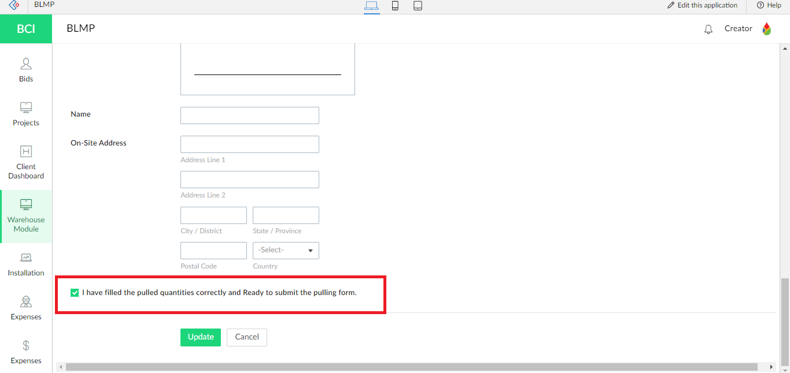
*Image c : Validation in Pull*

##### Exceptions

##### Damage Report

​		Damage report contains the details Items that are damaged in the ware house.i.e After Receiveing from the Debit Note.To add Damage Record click on *+Report Damage* button on Damage Report shown in the *Image 34-1*.

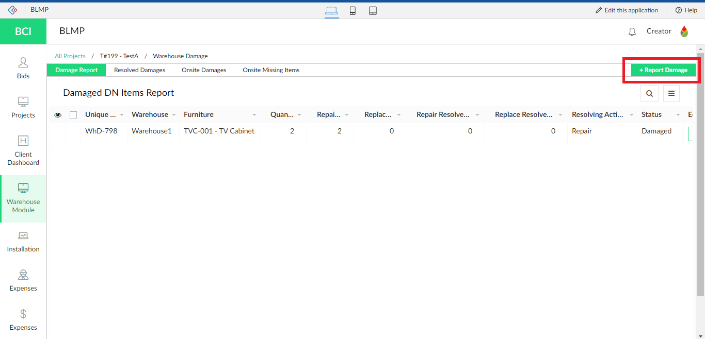
*Image 34-1 : Report Damge Button on Damage Report*

​		After Clicking on Report Damage Button,a form will get loaded will looks as Shown in *Image 34-2*.Fill all the necessary details such as Furniture,Warehouse,Qty and Damage Stage.After entering all the details click on submit button.Record will get added into *Damage Report*.

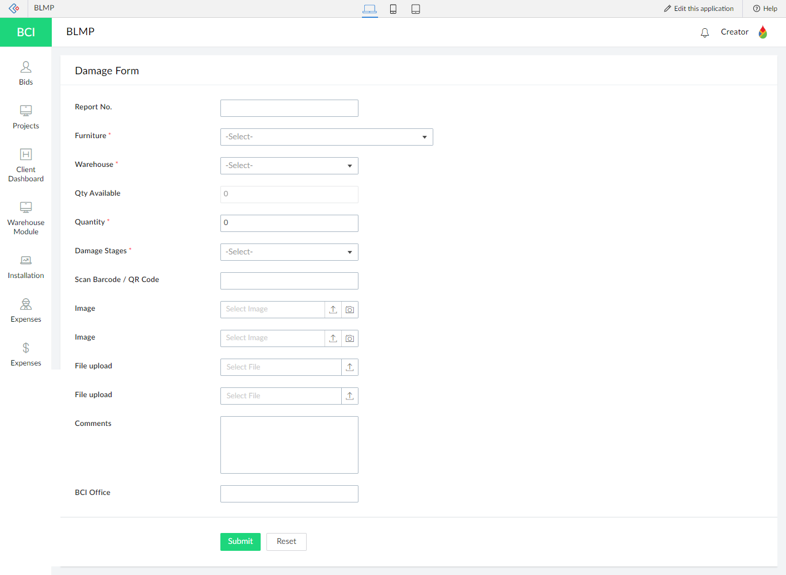
*Image 34-2 : Report Damge Form*

​		After Creating Damage record,For Updating *Resolving Action*, Click edit on the Record you want update Resolving Action.You can See *Resolving Action* field in Damage form as shown in *Image 34-3*.Select any one option from *Repair,Resolve,Repair & Resolve*. if Resolve action type is Replace,once after the creation of Delivery Note and Receive DN for replacements,the item Qty will get reverted.

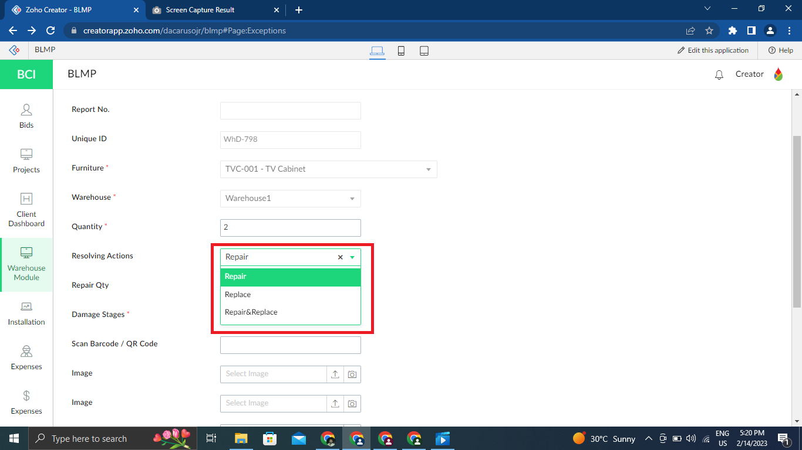
*Image 34-3 : Resolve Action*

​		For Repairing a Particular Item,Click on *Edit Repair* Button on Damage report as shown in *Image 34-4*.After clicking on Edit Repair a small pop-up will appear as shown in *Image 34-5*.Fill *Repaired Qty*.After clicking on Submit button,Item will get repaired and will get changed in the project.


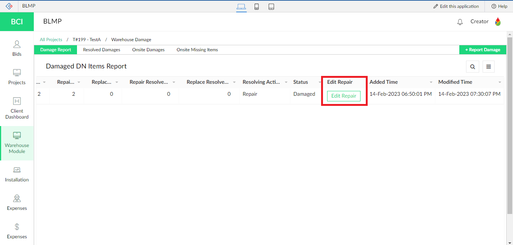
*Image 34-4 : Edit Repair Button*

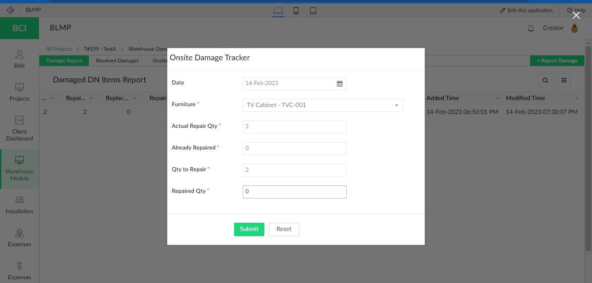
*Image 34-5 : Edit Repair form*


**Resolve Damages**

​		Damages which get resolved either by Repair / Replace,All those records details will be displayed in the Resolve Damage Report.

**Onsite Damage**

​		Onsite Damage Report shows the details of Items that are damaged during the onsite receiving,Instalation.You can Report Onsite Damages on Onsite [Onsite Installation Damage](#onsite-installation-damage),[Room Damage](#room-damage) and [Walkthough Damage](#walkthough-damage) as shown in the *Image 34-6*.

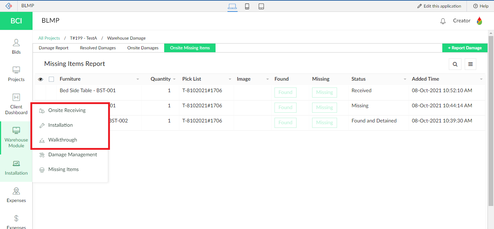
*Image 34-6 : Onsite Damage Reporting Place*

**Onsite Missing Items**

​		Onsite Missing Items contains the details of Items that are Missing either will Sending for Installation or During the Installation time period. 

##### Floor Wise Shortage

​		Shortage report show shortage of furnitures stock needed to fulfill furnitures needed to be installed in floor based on *Actual Received* quantity to the warehouse via deliver notes in [Receiving](#receiving) process. This report takes he current actual received quantity from the [Inventory](#inventory) and distribute it throughout the floor created a project. You can access this report from *Warehouse Module &rarr; Floor Wise Shortage*. As shown in *Image 28*, Will list out information like Required Quantity, Actual Received Quantity, Total Shortage Quantity, etc. 

| Column Name                                      | Description                                                  |
| ------------------------------------------------ | ------------------------------------------------------------ |
| Item                                             | Item code of the furniture                                   |
| Description                                      | Furniture full name or description                           |
| Actual Received                                  | Actual quantity of furnitures received in to [Warehouse Inventory](#inventory) via [Receiving](#receiving) process. |
| Pulled                                           | Quantity of furnitures already pulled in [Pulling](#pulling) process and available for On-Site Receiving and Installation. |
| Damaged                                          | Quantity of furnitures reported as damage in warehouse for various reasons. |
| Inventory Qty<br />(On Hand)                     | Quantity of furnitures currently available in inventory and ready for picking from in [Picking](#picking) process. |
| Floor: \<floor_number><br />Tower: \<tower_name> | This columns will show After on hand Qty,Need Qty,Picked Qty,Onsite Damaged Qty,Onsite Resolve Qty,Needed/Picked Qty and Shortage Qty. <br />If there is any shortage, the shortage count will be shown in cell marked as red. |
| Required Qty                                     | Actual needed quantity of the given furniture in a project.  |
| Total Shortage                                   | Remaining quantity of furniture needed to fulfill all floors in the project. |
*Table 5: Floor Wise Shortage report column description.*

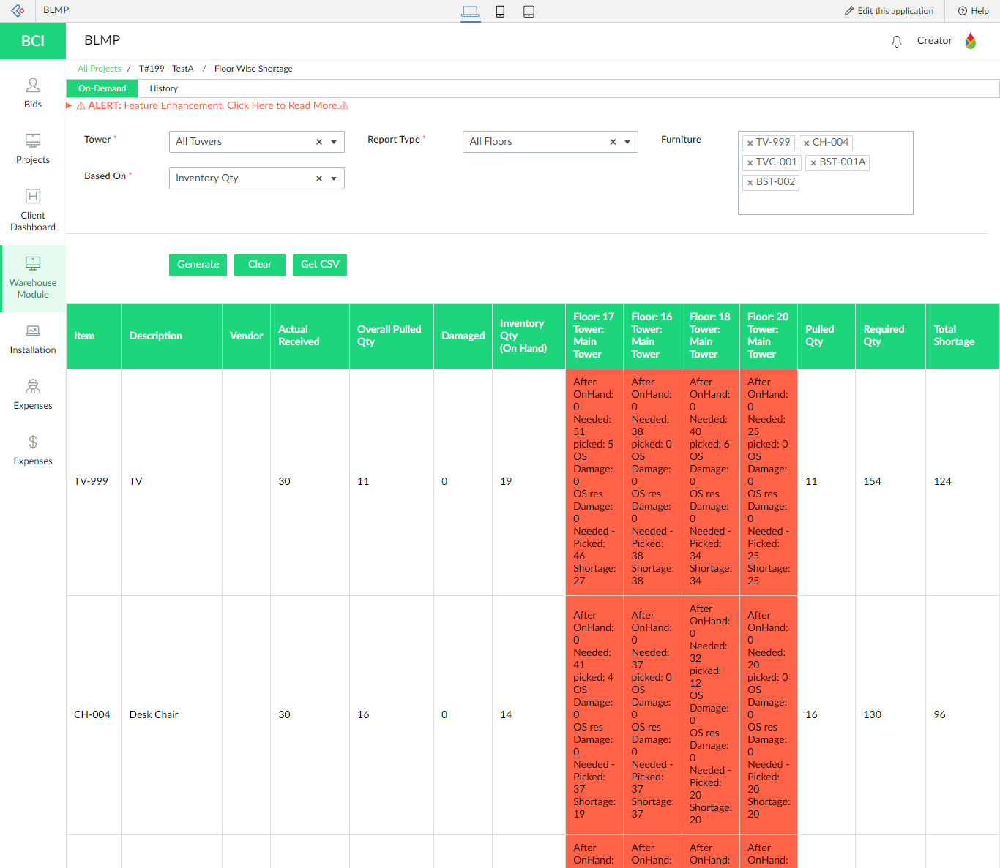*Image 28: Room Wise Shortage Report.*

​		This report have option to export the report in CSV format as shown in *Image 29*. This CSV data can be saved as CSV file and later opened in any spread sheet processing software for better readability. This report also have feature to apply filters to limit the report generation specific to selected Floors and Furnitures if need. 

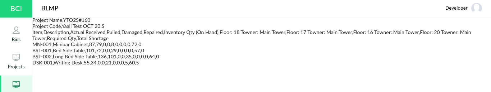

*Image 29: Floor Wise Shortage report CSV export format.*

>  ***Note:*** *If a project have more number of floors and furnitures the report can not process all floors and furnitures at same time, due Zoho Creator's statement execution limit as mentioned in [this documentation](https://help.zoho.com/portal/en/community/topic/deluge-statement-execution-limit-exceeded-the-maximum-limit). We recommending using the filter option either to limit the number of floors or furnitures to avoid ```"The number of deluge statement execution limit exceeded the maximum limit"``` issue.*


##### Room Wise Shortage

​	Room Wise Shortage report is similar to [Floor Wise Shortage](#floor-wise-shortage) report. Instead of shown the shortages floor wise, this report will show the shortages room wise. You can access this report from *Warehouse Module &rarr; Room Wise Shortage*. This shortage will be as shown in *Image 30,* listing the shortages of furnitures in room based on the *Actual Received* quantity of warehouse inventory.

| Column Name                  | Description                                                  |
| ---------------------------- | ------------------------------------------------------------ |
| Item                         | Item code of the furniture                                   |
| Description                  | Furniture full name or description                           |
| Actual Received              | Actual quantity of furnitures received in to [Warehouse Inventory](#inventory) via [Receiving](#receiving) process. |
| Pulled                       | Quantity of furnitures already pulled in [Pulling](#pulling) process and available for On-Site Receiving and Installation. |
| Damaged                      | Quantity of furnitures reported as damage in warehouse for various reasons. |
| Inventory Qty<br />(On Hand) | Quantity of furnitures currently available in inventory and ready for picking from in [Picking](#picking) process. |
| Room: \<room_number>         | This columns will show After On Hand Qty,Needed Qty,Picked Qty,Onsite Damaged Qty,Onsite Resolved Qty,Needed/Picked Qty and Shortage Qty. <br />If there is any shortage, the shortage count will be shown in cell marked as red. |
| Required Qty                 | Actual needed quantity of the given furniture in a project.  |
| Total Shortage               | Remaining quantity of furniture needed to fulfill all floors in the project. |
*Table 6: Room Wise Shortage report column description.*

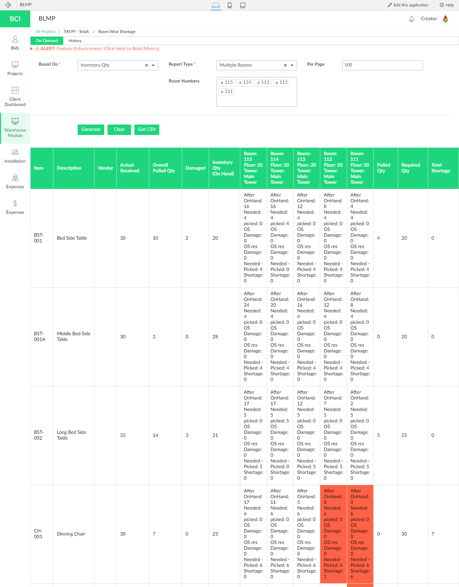

*Image 30: Room Wise Shortage report.*

​		This report also have option to export the report as CSV format and allows to apply filters to limit the report generation specific to selected Rooms and Furnitures if need. 

> ***Note:*** *If a project have more number of rooms and furnitures the report can not process all rooms and furnitures at same time, due Zoho Creator's statement execution limit as mentioned in [this documentation](https://help.zoho.com/portal/en/community/topic/deluge-statement-execution-limit-exceeded-the-maximum-limit). We recommending using the filter option either to limit the number of rooms or furnitures to avoid ```"The number of deluge statement execution limit exceeded the maximum limit"``` issue.*


#### Inventory

​		Inventory module allow to keep track of furnitures in which are brought in to application via receiving process and thought the application up-to walk-though process. We have both *Overall Inventory* and *Warehouse Inventory* in  BLMP application. We have discussed these reports in details in following sub-sections.

**Overall Inventory**

​		Overall Inventory will have list of furnitures you have received into warehouse irrespective of warehouse (i.e., Sum of all inventory from all warehouse) via [Receiving](#receiving) process. You can access this module from *Warehouse Module &rarr; Inventory &rarr; Inventory tab*. Following are list of column shown in the Overall Inventory:

| Column Name                | Description                                                  |
| -------------------------- | ------------------------------------------------------------ |
| Furniture                  | Name of the furniture.                                       |
| Item Code                  | Item code / SKU of respective furniture.                     |
| Description                | Any Description or Comment added while importing furnitures into project. |
| Vendor                     | Name of furniture added while importing furnitures into project. |
| PO#                        | PO number added while importing furnitures into project.     |
| DN#                        | List of delivery notes from which furniture are received into warehouse respectively. |
| Warehouse                  | Name of warehouse the furniture belongs to.                  |
| Storage Type               | Storage Type number added while importing furnitures into project. |
| Project Quantity           | Project Quantity added while importing furnitures into project. |
| Received Quantity          | Quantity of furniture received into warehouse via [Receiving](#receiving) process |
| Stock In Hand              | Quantity of furniture currently available in inventory after [Picking](#picking) and [Pulling](#pulling) process. <br />i.e., *Stock In Hand* = *Received Quantity* - *Pulled Quantity* |
| Pulled Quantity            | Sum of Picked and Pulled quantity from warehouses via [Picking](#picking) and [Pulling](#pulling) process. |
| On-site Receiving Quantity | Quantity of furnitures received at installation site out of *Pulled Quantity.*<br />i.e., *Pull Quantity* >= On-site Receiving Quantity |
| Installed Quantity         | Quantity of furniture installed on-site in [Installed](#installation) process. |
| Damage Quantity            | Quantity of furniture reported as damage in [Exceptions](#exceptions) or [Damage Management](#damage-management) progress. |
| Repaired Quantity          | Quantity of furniture repaired out of reported Damage Quantity. |
| On-Site Excess Quantity    | Furnitures pulled more than required pick quantity and sent to on-site will be listed in this column. |
| Missing Quantity           | Quantity of furnitures reported as missing and not yet resolved. |
*Table 7: Overall Inventory report column description.*

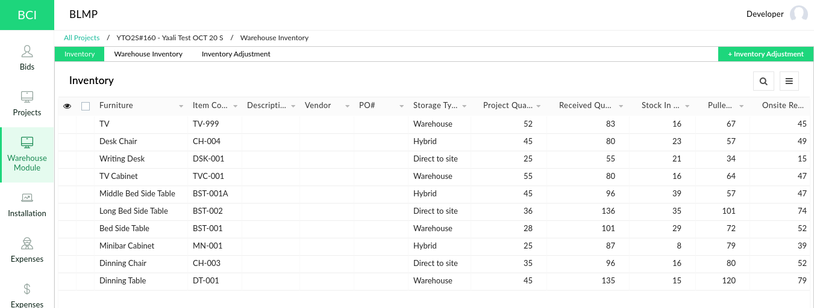

*Image 31: Overall Inventory report.* 

**Warehouse Inventory**

​		Warehouse Inventory will have list of furnitures you have received into warehouse respective to warehouse via [Receiving](#receiving) process. You can access this module from *Warehouse Module &rarr; Inventory &rarr; Warehouse Inventory tab*. Following are list of column shown in the Overall Inventory:

| Column Name                | Description                                                  |
| -------------------------- | ------------------------------------------------------------ |
| Furniture                  | Name of the furniture.                                       |
| Item Code                  | Item code / SKU of respective furniture.                     |
| Description                | Any Description or Comment added while importing furnitures into project. |
| Vendor                     | Name of furniture added while importing furnitures into project. |
| PO#                        | PO number added while importing furnitures into project.     |
| Storage Type               | Storage Type number added while importing furnitures into project. |
| Project Quantity           | Project Quantity added while importing furnitures into project. |
| Received Quantity          | Quantity of furniture received into warehouse via [Receiving](#receiving) process |
| Stock In Hand              | Quantity of furniture currently available in inventory after [Picking](#picking) and [Pulling](#pulling) process. <br />i.e., *Stock In Hand* = *Received Quantity* - *Pulled Quantity* |
| Pulled Quantity            | Sum of Picked and Pulled quantity from warehouses via [Picking](#picking) and [Pulling](#pulling) process. |
| On-site Receiving Quantity | Quantity of furnitures received at installation site out of *Pulled Quantity.*<br />i.e., *Pull Quantity* >= On-site Receiving Quantity |
| Installed Quantity         | Quantity of furniture installed on-site in [Installed](#installation) process. |
| Damage Quantity            | Quantity of furniture reported as damage in [Exceptions](#exceptions) or [Damage Management](#damage-management) progress. |
| Repaired Quantity          | Quantity of furniture repaired out of reported Damage Quantity. |
| On-Site Excess Quantity    | Furnitures pulled more than required pick quantity and sent to on-site will be listed in this column. |
| Missing Quantity           | Quantity of furnitures reported as missing and not yet resolved. |
*Table 8: Warehouse Inventory report column description.*

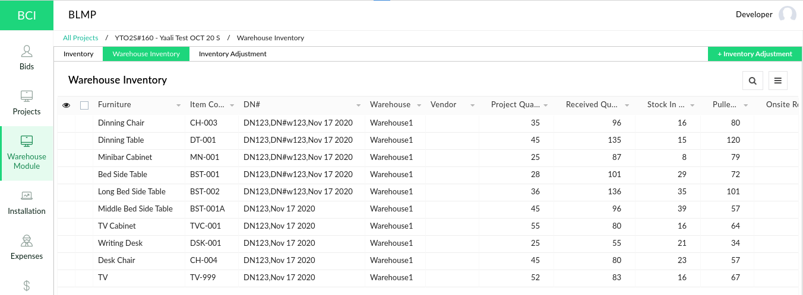

*Image 32: Warehouse Inventory report.*

> ***Note:*** *Both Overall Inventory and Warehouse Inventory will also visible in customer portal, So customer can also keep track of furniture though out various stages.*

**Inventory Adjustments**

​		Inventory Adjustment feature enable to manually adjust the inventory or transfer stock from one warehouse to another by reducing the stock in *From* warehouse and increasing the stock in *To* warehouse. Once *Inventory Adjustment* button is click from Inventory module, Form shown in *Image 34* will be opened to collect the some informations like *Warehouse, Furniture* and *Quantity*. Hotel and Project field will be auto-filled on form load based on current project selection. 

> ***Note:*** 
>
> * Negative values are allowed in Quantity.
>
> * Quantity should be prefixed with + (plus) or - (minus) symbol to adjust the inventory accordingly.
>
> * Example:
>
>   > Let us assume we have Item A of 15 quantity in inventory. To reduce 5 quantity from inventory -5 (minus five) should be given as Quantity. If you like to increase the inventory by 5, Then +5 (plus five) should be given as input in Quantity field.

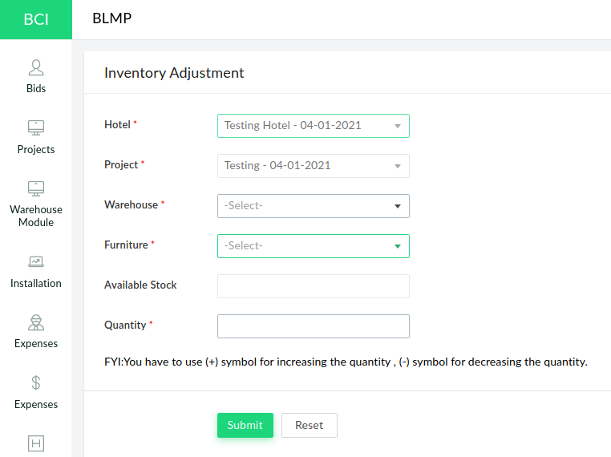

*Image 34: Inventory Adjustment form.*


#### Installation

##### OnSite Receiving

**Onsite Receiving**

​        Onsite Receiveing Report contains the details that are [Pulled](#pulled) and Waiting for on-site Receiveing.To receive all Items that are pulled, click on edit option for the required record(*as shown in Image a*).After click on Edit a new Form will get loaded which will looks as shown in *Image b*.You can three check boxes present(which will looks as shown in *Image c*) in form they are *Handover These Item While On-Site Receiving,Damage Replacement,Receive All*.Click the necessary option.*Note* if Receive All Check box is Ticked,It will fill Receieved Qty for all the Items based on *Tota Picked Qty*.

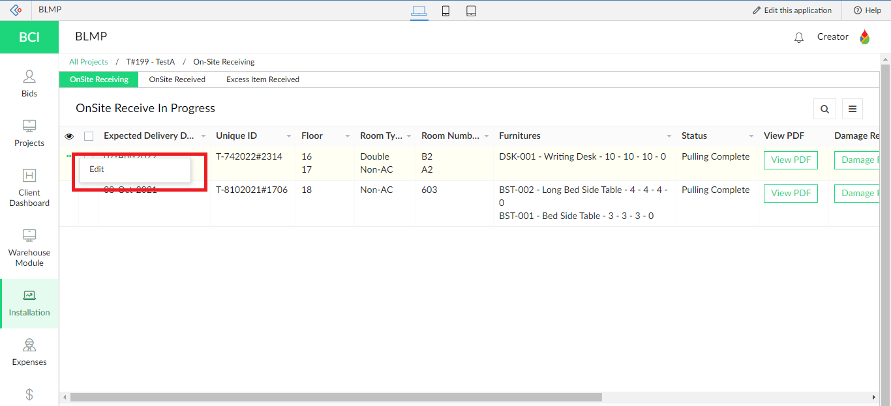
*Image a: Edit for On-site Receive*

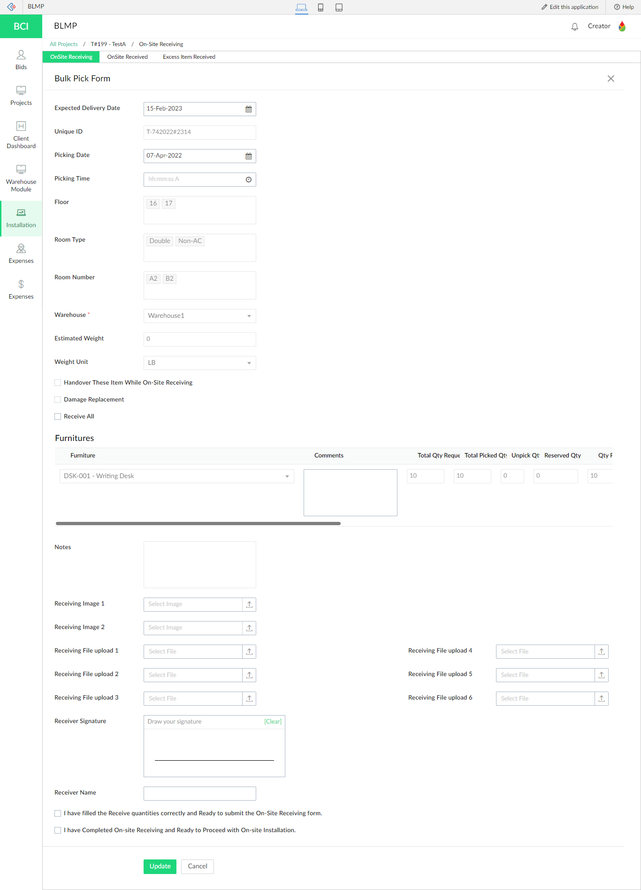
*Image b : Form for On-Site Receive*

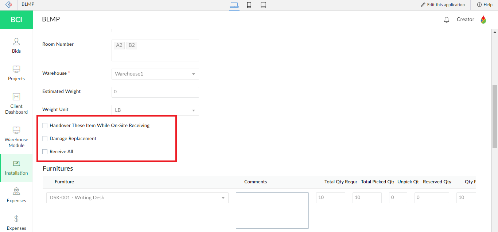
*Image c :Check Box on Report*

​        After entering all details Check all the checkbox mentioned in *Image d*.You can only Submit the record only after ticking below two check boxes.

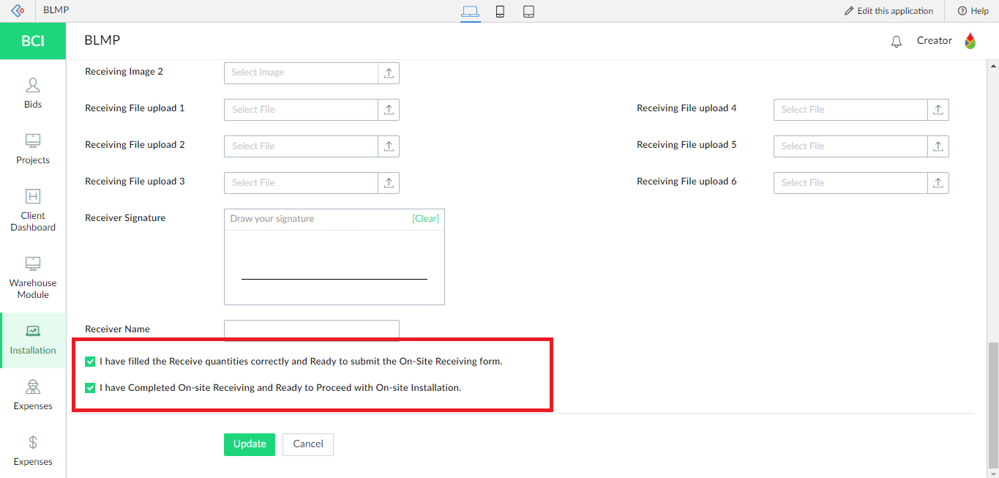
*Image d:Validation Check Box*

##### Onsite Damage

​        For Report Damaging happend during onsite receive,click on *Damage Report* button shown in *Image - e*.After clicking Damage report button, a new form will get loaded as shown in *Image f*,Fill all the necessary details for Damage Details and click on submit button.You can view [Damage Management](#damage-management)

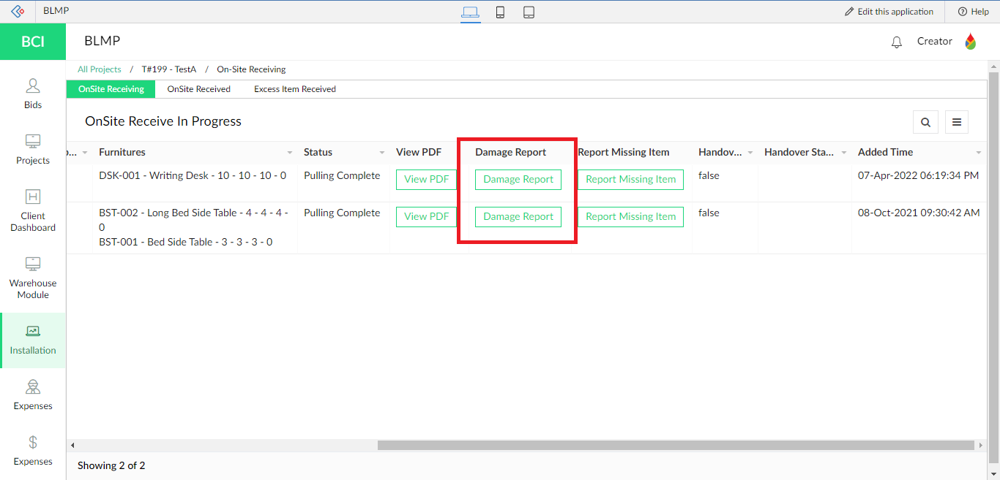
*Image e : Damage Button*

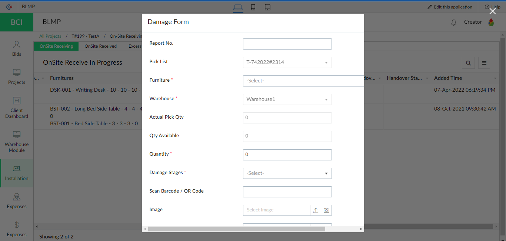
*Image f:Damage form*

**Onsite Received**

​       Onsite Received report contains the details report that are Received from [Onsite Receiving](#onsite-receiving)

**Excess Item Received**

​       Excess Items Received Report contains the details of items that are received excess during process of on-site Receiving.To handle a Excess Receive Item click on the *+Use Excess* button as shown in *Image e*.After click on the button a new form will get loaded which will looks as shown in *Image f*.Fill all the necessary details such as type of process etc.Project Name will pre-populated.After entering all the details click on submit button.

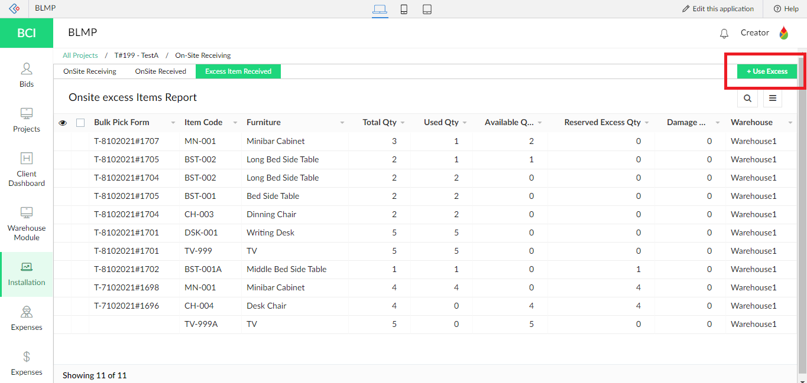
*Image e: Edit Button in Excess Report*

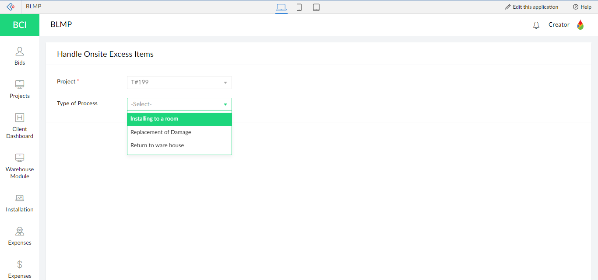
*Image f: Handle excess items Form*


**Onsite Intallation Master**

​      Onsite Intallation Master Report contains the details of items that Deleivered/Install for a particluar room room.Once after all Items are Received on On-site.You can add Delivery/Installation details in Onsite Installation Master report.Click on Edit option for the record you want to add Delivery/Install Details.

​      You can add Delivery/Install Qty in Installation Product sub-form as shown in *Image h*.There are tow check box present in onsite installtion master form as shown in *Image i*.If Deleiver All is checked *Deleivery Qty* Filed will automatically populated based on Qty Deliver Field.If Install All filed is checked *Install Qty* will be automatically populated based on *Qty to Install*.

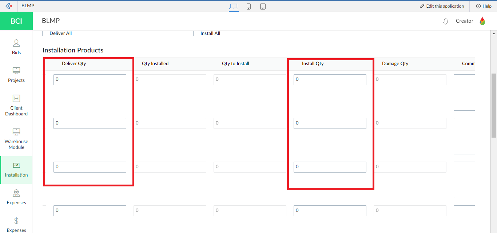
*Image h : Delivery/Install Qty*

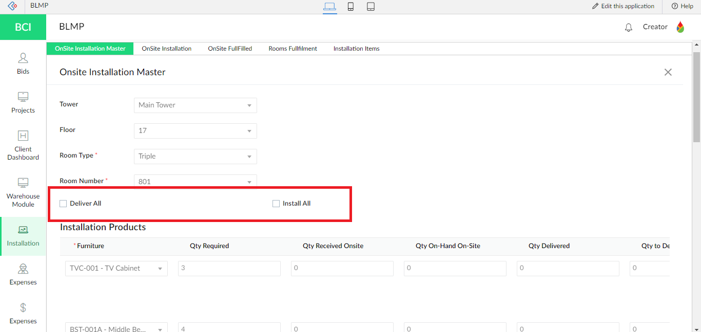
*Image i : Delivery/Install Check box*


**Onsite Installation**

​      Onsite Installation Report Contains the Details of Items received on on-site based on rooms.

##### Onsite Installation Damage

​      For Reporting Damage that occur during onsite installation damage click on *Damage Report* Button mentioned in *Image a*,and a new form will apprear as shown in *Image b*.Fill All the details and click on Submit Button. 

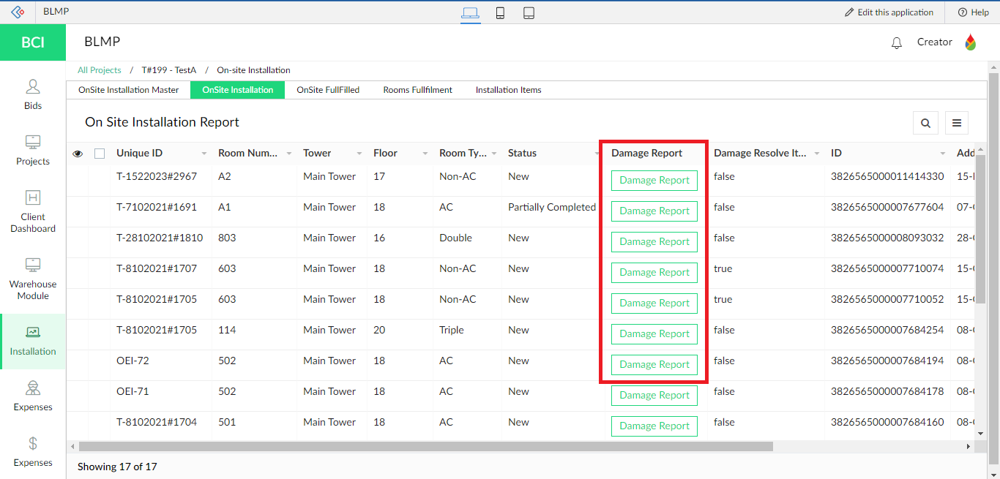
*Image a : Onsite Installation Damage Button*

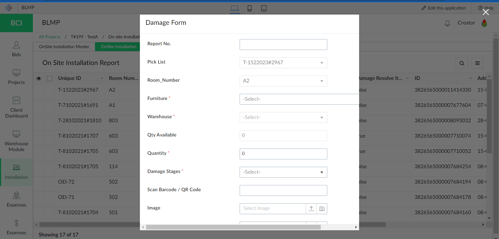
*Image b: Onsite Installation Damage form*

**Onsite FullFilled**

​      Onsite FullFilled contains the details of Install status of items based on received from on-site and room number.


**Rooms Fullfillment**

​      Rooms Fullfillment Report show the details Install product status of Items based on rooms.We can also check Installation Staus and Progress of Installation for Rooms.

#### Room Damage

​      To Report Damage during Room Fulfilment Clcik on *Damage Report* Button as shown in *Image c*,and follow [Onsite Installation Damage](#onsite-installation-damage) Procedure.

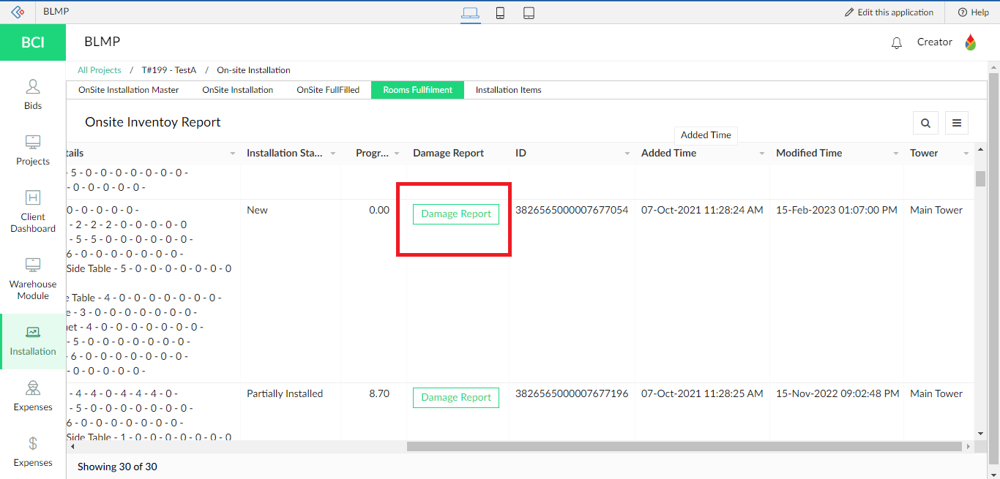
*Image c : Damage Report Button on Room Fullfillment*

**Installation Items**

​      Installation Items report contains Details such as Required Qty,Picked Qty,Damaged Qty,On-Hand Qty,Qty to Install,Qty to Deleiver based on Items and rooms.


###### Walkthough

**Room Fullfillment**

​      After Installation process,For walkthough rooms Click on *Walkthough* button shown in *Image 1*.A new form will get loaded will looks as shown in *Image 2*.Please Fill the *Walkthough Qty* filed as mentioned in *Image 3*.After entering wlakthough details fill all the madantory details such as name,signature and clcik on submit button.

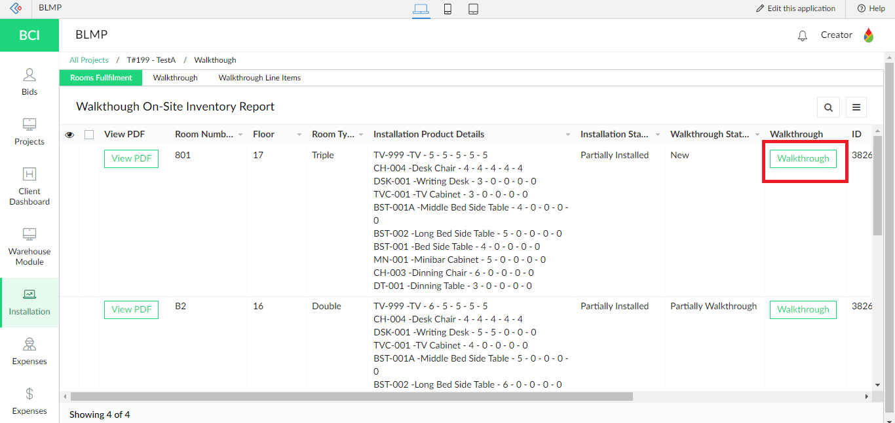
*Image 1: Walkthough Button*

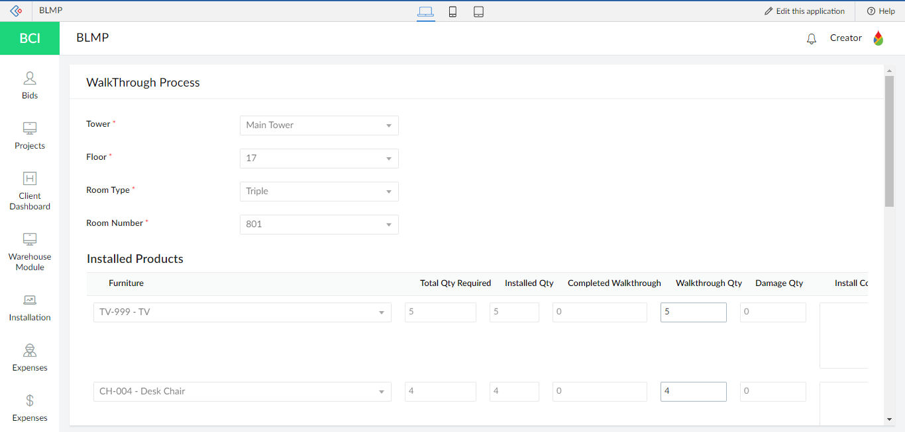
*Image 2: Walkthough form*

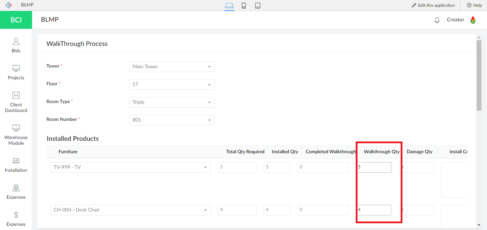
*Image 3: Walkthough Qty*


​      Walkthough report shows the details of Rooms that are wlakthoughed.You can also view line items based walk though report on *Walkthough Line Items* reprot mentioned in *Image 4*.


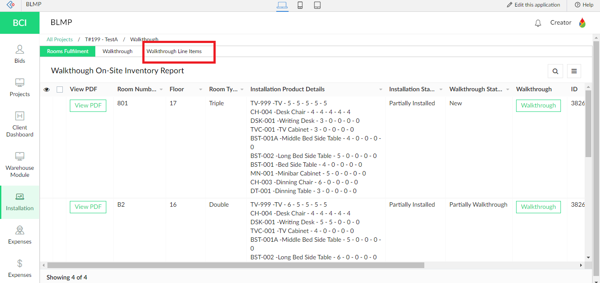
*Image 4: Walkthough Line Items*

##### Walkthough Damage

​      For Reporting Damages that Occur during Walkthough process,Click on *Damage Report* button as shown in *Image 7* and follow [Onsite Installation Damage](#onsite-installation-damage) Procedures.

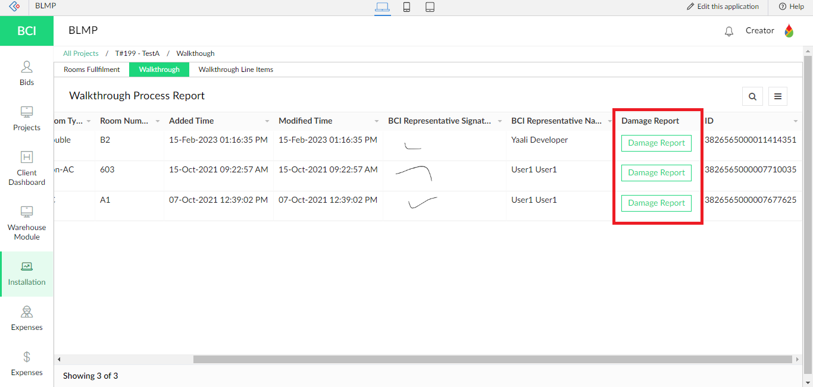
*Image 7 : Walkthough Damage Button*

##### Damage Management

**Damage Report**

​      Damage report contains the details Damaged Item Quantites,Repair and Replaced Qty and the staus of the damage.

**Resolved Damage**

​      Resolved Damage report contains the details of damaged Items that are resolved.Refer [Damage Report](#damage-report)

##### Missing Items

**Missing Items**

​      Missing Item Report contains the details Items that are Missed during Installation,Onsite receive etc.

#### Settings

##### Customers

​        Customers module allow to maintain the details of the customer like Name, Contact Person, Phone, Address, etc. We have given the contacts as sub-form as shown in the *Image 7* since there may be more than one contact person. Contacts can also be able to added or removed from Customer form itself or contact can later be associated to a customer, We have explained this process in [Contacts](#contacts) section. You can create a new customer from *System Settings &#129042; Customers &#129042; Click on Plus Button*. A customer form will be open to collect the customer information.

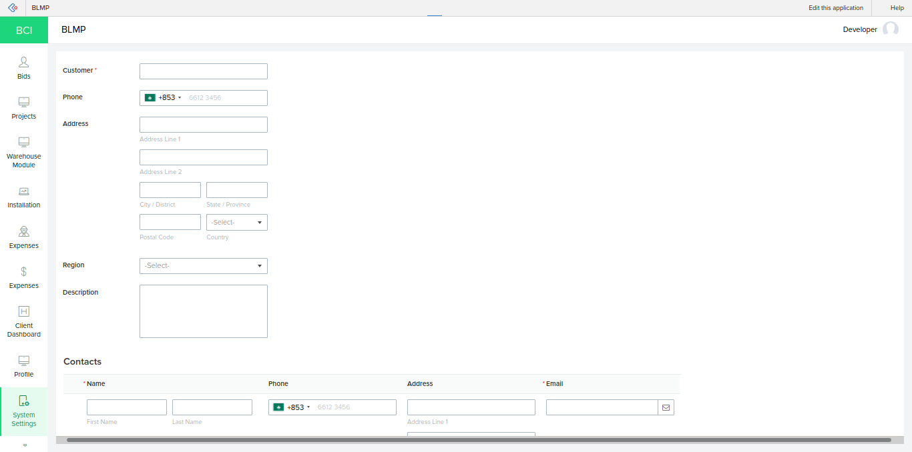
*Image 7: Customer Form*

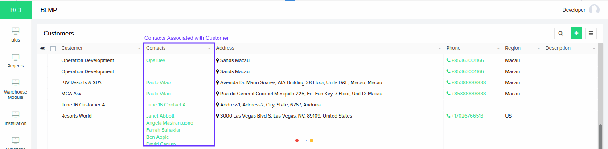
*Image 8: Customers List Report.*

##### Contacts

​        Contacts module is similar to customer module allows to store basic information of person how is going to representative of the customer. Customer module also serves as a place where we can enable or disable access of [Customer Portal](#customer-portal). We can create contact in application from *System Settings &#129042; Contacts &#129042; Click on Plus Button*.

> ***Note:*** *Customer should be created first in order to add create or associate a contact to customer. As mentioned in customer section contacts can be created from customer module itself.*

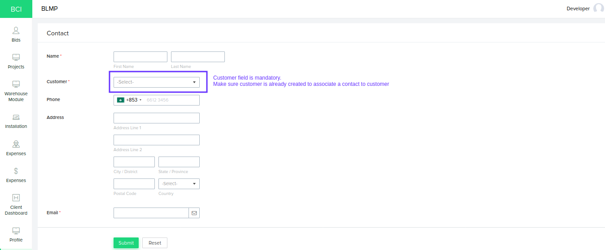
*Image 9: Contact Creation Form.*

If the customer field is selected while creating a contact. The system will automatically associate the created contact with respective customer in Customer module as sub-form line item.

**Granting and Revoking access to Customer Portal**

​        As mentioned in the introduction of the contact module, This module can also used to manages access to customer portal. If a contact is not give customer portal access yet you can field an option called *Grant Customer Portal Access* in *System Settings &#129042; Contacts* as shown in *Image 10*. Once this button is clicked a email invite will be sent to respective email ID added to the contact. Once customer have accepted the invite they have read-only access to the project to which they have added as contact.

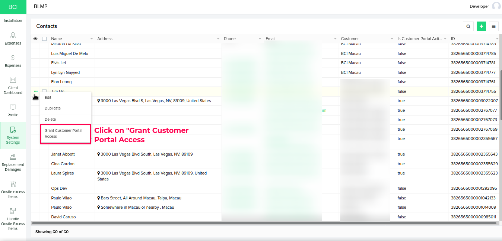
*Image 10: Granting customer portal access from Contact module.*

​        If customer is already given access to customer portal *Grant Customer Portal Access* action will not be available any more. Instead you can find a option called  *Revoke Customer Portal Access*, This option allow to revoke access given to customer portal for a given customer as shown in *Image 11*. You can also use *Is Customer Portal Active* column to check a contact is having customer portal access or not.

> ***Note:***
> 
> * *If customer didn't get invite mail in inbox ask them to check in spam or trash once.*
> * *Invalid email ID may be another reason why invite was not sent.*
> * *Maximum number of customer portal user may have reached.*

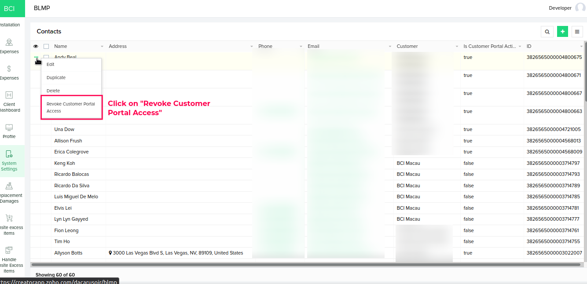
*Image 11: Revoking customer portal access from Contact module.*

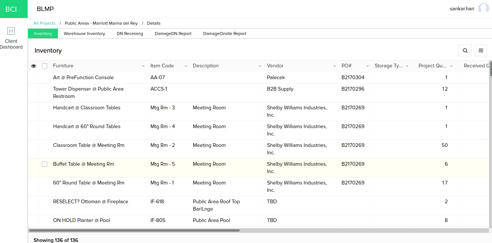
*Image 12: Customer project detail view*

We will discuss regarding the customer portal module in details under [Customer Portal](#customer-portal) section. For information you can also refer to this [Zoho Creator Documentation](https://www.zoho.com/creator/newhelp/application-sharing/understand-customers.html).

##### Employees

​        Employees are application users, These are who is going play various roles in the BLMP Application like Project Manager, Project Coordinator, Warehouse Staff, etc. Based on the roles under which a employee is getting added, the some of modules access will be restricted. For Example, Let us assume we are adding a user under Warehouse Manager Role. He/She will be access to module that are specific to warehouse handling like Overall Inventory, Warehouse Inventory, Warehouses, Picking, etc.  

​        We have used Zoho Creator's roles and permission features to grant or restrict access to various modules of BLMP Application. To know more about the roles and permission please refer this [Zoho Creator Documentation](https://www.zoho.com/creator/newhelp/application-sharing/understand-users.html)

​        You can add a new employee to the application from *System Settings &#129042; Employees &#129042; Add new Employee* button as shown in the *Image 13*.

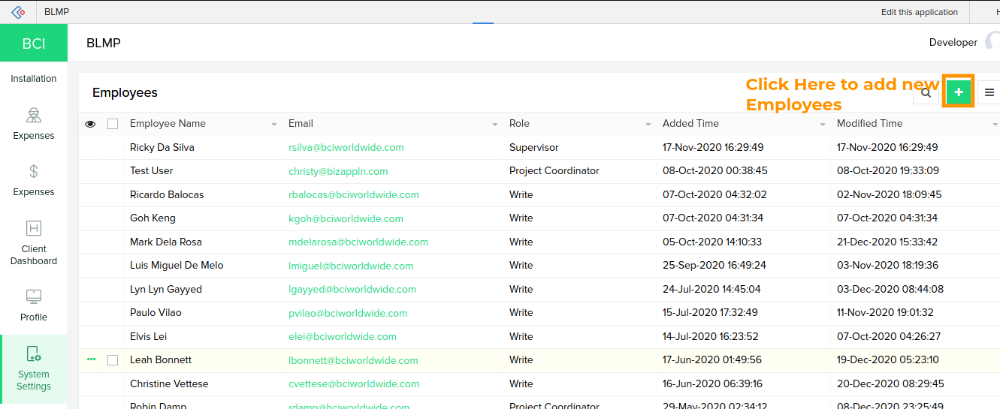
*Image 13: Employee list report.*

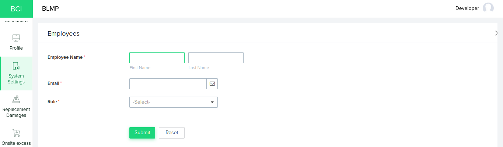
*Image 14: Form to add new employee in application*

​    Once employee details are entered and clicked on submit. Application will add this Employee as user in the BLMP application. An email invite will be sent to email ID given in from while adding a new user.  If you try to edit a existing employee's email ID access to old email ID will be revoked and Invite will we sent to new email ID.

> ***Note:***
> 
> * *User email address should be unique.*
> * *Please check for invite mail in Spam and Trash mail too.*
> * Invalid email ID.
> * Adding the user may fail when maximum number purchased user license have reached.
