## BLMP Application - Documenation

### Zoho Creator Application

#### Table of Contents

1. [Introduction](#introduction)
2. [Accessing This Application](#accessing-this-application)
   1. [Application User](#application-user)
   2. [Customer Portal User](#customer-portal-user)
3. [Bids](#bids)
   1. [Bid Creation](#bid-creation)
   2. [Bid Pricing](#bid-pricing)
   3. [Bid Approval](#bid-approval)
   4. [Bid to Project Conversion](#bid-to-project-conversion)
4. [Projects](#projects)
   1. [Project Wizard](#project-wizard)
   2. [Project Details](#project-details)
   3. [Hotel Details](#hotel-details)
5. [Warehouse Module](#warehouse-module)
   1. [Warehouse Location](#warehouse-location)
   2. [Receiving](#Receiving)
   3. [Picking](#picking)
   4. [Pulling](#pulling)
   5. [Exceptions](#Exceptions)
   6. [Floor Wise Shortage](#floor-wise-shortage)
   7. [Room Wise Shortage](#room-wise-shortage)
   8. [Inventory](#inventory)
6. [Installation](#installation)
   1. [On-Site Receiving](#on-site-receiving)
   2. [Handover Process](#handover-process)
   3. [Installation](#installation)
   4. [Walkthough](#walkthrough)
   5. [Damage Management](#damage-management)
7. [Settings](#settings)
   1. [Customers](#customers)
   2. [Contacts](#contacts)
   3. [Employees](#employees)
8. [Customer Portal](#customer-portal)

#### Introduction

​		BLMP Application helps to track the project in various of the project from the biding to installation and walk-through process. This application have various processes like [Receiving](#receiving), [Picking](#picking), [Pulling](#pulling), [On-Site Receiving](#on-site-receiving), [Installing](#installation) and [Walkthough](#walkthrough) process based on Project you create with the application to handle furnitures which are needed to a room in a hotel.  This application also include reports like Floor Wise Shortage, Room Wise Shortage and Profitability Report based on data we have generated in a project.

​		This documentation explains various process developed in this application and walk-thought the each stages of process from the bid creation to completing the walkthough process.

#### Accessing This Application

​		BLMP Application can be accessed by users in two different modes, either as application user or customer portal user. Customer Portal mode will have only access to specific module of the application with read-only access. Customer or Agents are given access to the application via customer portal to check on the progress of project in which they are involved. Regular employee like Project Manager, Project Coordinators and Warehouse Staffs will have access to application as Application User. 

*Image 1: Zoho Creator Application Dashboard*

##### Application User

​		Application User can gain access to the application when application admin or project manager add them as user in the BLMP application. Once a new user is added to the application a email invite will be sent to given user's email address.

​		To access BLMP application from Zoho Creator Dashboard go to [Zoho Creator login page](https://www.zoho.com/creator/login.html) and login into Zoho Creator account your user name password. For more details refer this [Zoho Creator documentation](https://www.zoho.com/creator/newhelp/getting-started/signin-zoho-creator.html).

​		According to BLMP application user can also be able added as user by adding a employee into the application. This process is explained in detail under [Settings > Employees](#employees) section.

##### Customer Portal User

​		Customers can given access to application via Zoho Creator Customer Portal. Customer can login to the application from [Customer Portal Login Page](https://bciworldwide.zohocreatorportal.com/). Once logged in they will be having access to projects in which they have added as contact as shown in *Image 2*. Granting access to customer portal to customer portal will be explained in details in [*System Setting &#129042; Contacts*](#contacts).

**Customer Portal URL:** *https://bciworldwide.zohocreatorportal.com/*

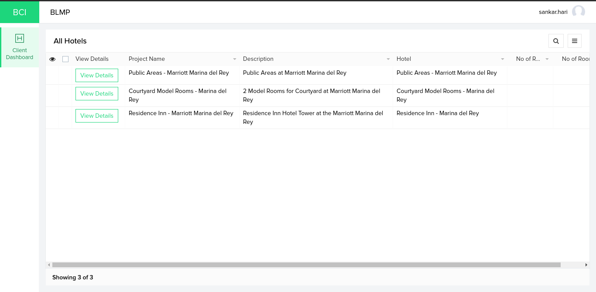

*Image 2: Zoho Creator Customer Protal project list*

> **Note:** If you added a user to customer portal with email id domain same as app admin Zoho Creator will allow this email as customer portal user. This email can only be added as application user instead. 
>
> *Example:*
>
> > App Admin Email: admin@bciworldwide.com
> >
> > Lets assume we are trying to added user3@bciworldwide.com or staff@bciworldwide.com as user in customer portal. It is not possible, the customer portal email should be anything other than ***@bciworldwide.com*** in place of domain name like user2@holidayInn.com or user2@gmail.com or customer@xyzhotel.com can be added to customer portal as user.

#### Bids

​		Bids are feature in BLMP application to maintain details of the Bids BCI is participating. This feature allows to store various details like basic details like Project Name, Customer, Contact, Lead Source and files related receptive bid as shown in *Image 3*. Bid also includes feature adding the project pricing along with a pricing approval process as shown in *Image 4*.

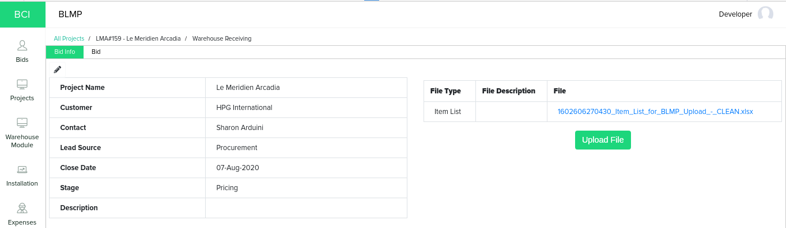

*Image 3: Bid Info page*

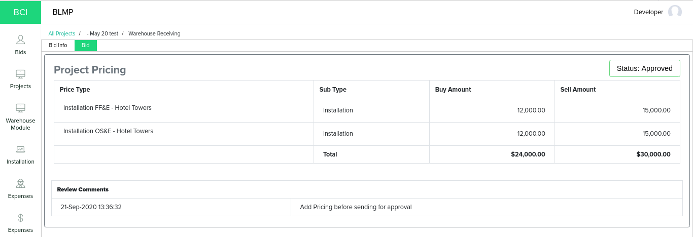

*Image 4: Approved Project Pricing under Bid details page.*

##### Bid Creation

We can able to create a Bid in the application by providing some basic regarding the bid as shown in *Image 3*. We can start the Bid creation process from *Bids &#129042; Pricing &#129042; Click on Plus Button* as shown in below *Image 5* . Once the button is clicked it will open a form to collect information regarding the bid as shown in Image 6, Once details are filed in and click on *Submit* a bid will be created in the application and redirected to [Bid Pricing](#bid-pricing).

> ***Note:*** 
> *Before creating a bid in application customers and contacts needed to be created in customers module. If the customer already exist, the existing customer can be reused. We have explained the customer and contact creation in [Customers](#customers) Section.*

*Image 5: Bids list page.*

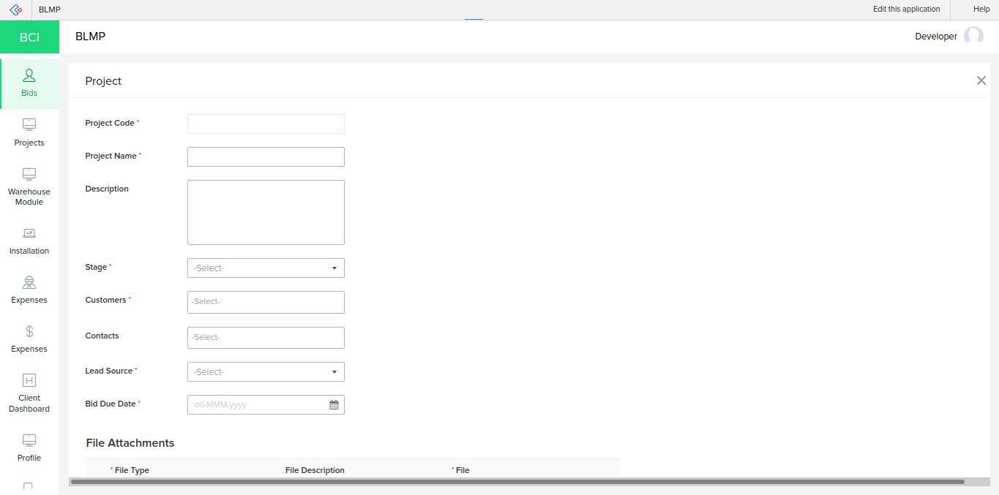

*Image 6: Bid Form.*

##### Bid Pricing

​		Bid pricing is a feature used in the application capture your bidding amount over a project/tender. We can also add estimate of pricing split-up of various expenses which you may have on various resources and services which are going to be offering to the customer as *Buy Amount* and *Sell Amount*. The page shown in *Image 15* will be shown immediately after a bid is created.  You can click on *Add Price Type* button to add a new price type into new or existing bid you have created. Form shown in *Image 16* will be opened to collect the price type, sub type and pricing information. While adding price types to a bid, new price type or sub type can be created from the bid from itself.

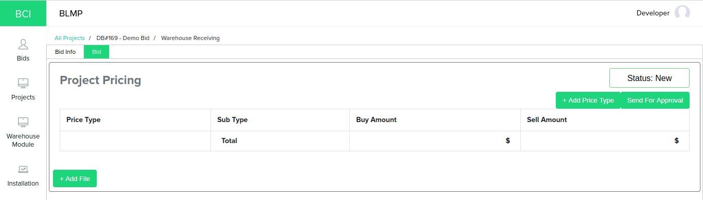

*Image 15: Bid Pricing Page*

​		

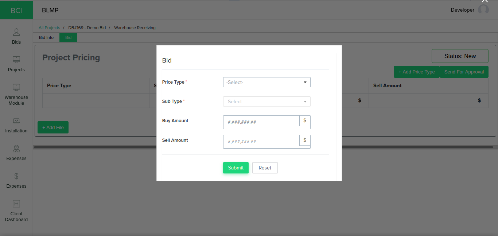 

*Image 16: Adding Price Type Bid Pricing.*

​		Once the prices types are added to pricing Bid Pricing Page will looks like as shown in *Image 17*. We enable to option to delete or edit the price type added to the pricing when needed. We have also implemented a approval process for getting permission from user from higher hierarchy. We have discussed the approval process in details under [Bid Approval](#bid-approval) section.

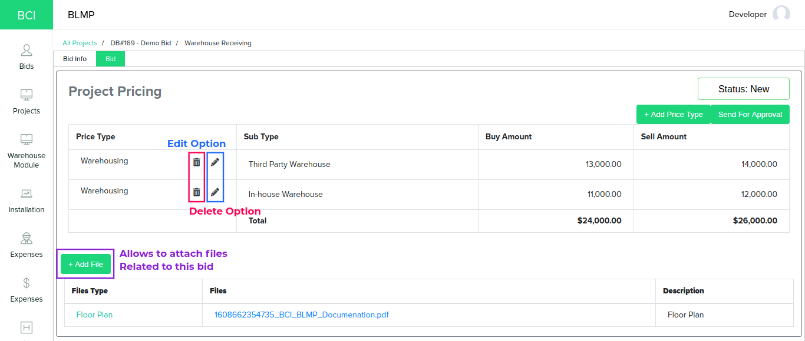

*Image 17: Bid pricing page after adding some price type to the bid.*

##### Bid Approval

​		In bid approval process once bid pricing is completed, The bid can be sent for approval to based on hierarchy. In BLMP Application we have two hierarchy, Bid Creator and Bid Approver. Users under Bid Creator and Bid Approver both have access to create, edit and delete a price type in bid pricing process. But the Bid Approver have privilege to approve or review the bid pricing submitted by Bid Creator as shown in *Image 18*.

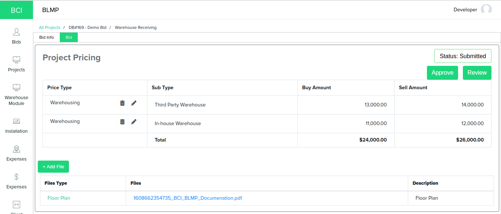

*Image 18: Bid Pricing after submitting for approval of Admin Approver*

​		You can notice in the status of *Bid Pricing* is update to *Submitted* from *New*. At this stage users in admin role will not have access to add, modify or delete a price type (i.e., Admin will only have read-only access once submitted for approval). Now users under Admin Approver role will access create, edit or delete access to price types added by Admin user. Apart from this they have privileged to *Approve* a pricing submitted or send it back for *Review* using the *Approve* or *Review* button shown in above *Image 18*.

​		If *Admin Approver* approves the pricing, the bid approval process will be completed and the bid pricing will be locked no more modification in pricing can be done by both the roles.

*Image 21: Approved pricing and Status updated to Approved*

​		If approver clicks on *Review* button, a window will prompt for *Review Comments* as shown in *Image 19*. Admin approver can adding review view in he rich text field and click on submit, Then status of the pricing will be updated to *Review* and Review Comment added by the approver will be shown to admin as shown in *Image 20*. At this stage pricing details can be revised or additional files can be attached by Admin and resubmit the pricing for approval again.

*Image 19: Rich-Text field to get review comment from approver* 

*Image 20: Status updated to Review and showing Review Comment added from Admin Approver*

##### Bid to Project Conversion

​		Once a Bid Pricing is approved and win, Bid created can be converted to project directly. You can go to *Bids &#129042; Approved &#129042; Edit* and update the *Stage* of bid to *Win*. Once the bid status is selected the application will show few more field like Project Owner, Employees, Hotel, Warehouse, etc as shown in *Image 21*. Once all those details where given you can click on submit to convert a Bid to a Project. Following are the field description of the project fields.

| Field Name       | Field Description                                            |
| ---------------- | ------------------------------------------------------------ |
| Project Owner    | BCI Employee who is going to be point of contact between BCI and Customer. |
| Employees        | Employees with different roles involved in this project. Only user who needs application access is sufficient. |
| Hotel            | A Hotel model needed to be created. Will holds the information of building and floor we are going to work on this project |
| Warehouse        | Warehouses going to be used in this project for storing he furnitures. |
| No of Rooms      | Number of rooms involved on this project                     |
| No of Room Types | Number of room types involved in this project.               |

*Image 21: Bid to Project conversion form fields*

> ***FYI:*** *A project can also be created directly by setting the bid stage to **win** directly to avoid the bid approval process.*

#### Settings

##### Customers

​		Customers module allow to maintain the details of the customer like Name, Contact Person, Phone, Address, etc. We have given the contacts as sub-form as shown in the *Image 7* since there may be more than one contact person. Contacts can also be able to added or removed from Customer form itself or contact can later be associated to a customer, We have explained this process in [Contacts](#contacts) section. You can create a new customer from *System Settings &#129042; Customers &#129042; Click on Plus Button*. A customer form will be open to collect the customer information. 

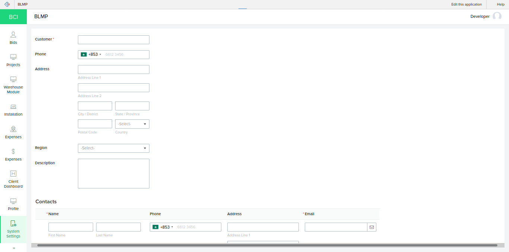

*Image 7: Customer Form*

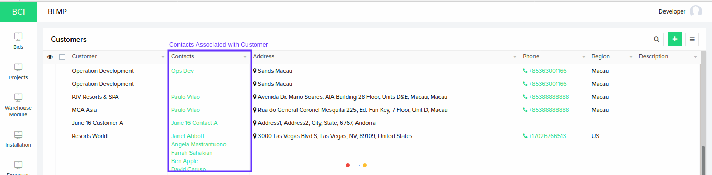

*Image 8: Customers List Report.*

##### Contacts

​		Contacts module is similar to customer module allows to store basic information of person how is going to representative of the customer. Customer module also serves as a place where we can enable or disable access of [Customer Portal](#customer-portal). We can create contact in application from *System Settings &#129042; Contacts &#129042; Click on Plus Button*.

> ***Note:*** *Customer should be created first in order to add create or associate a contact to customer. As mentioned in customer section contacts can be created from customer module itself.*

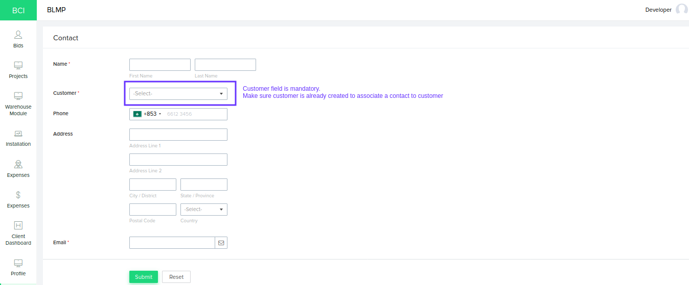

*Image 9: Contact Creation Form.*

If the customer field is selected while creating a contact. The system will automatically associate the created contact with respective customer in Customer module as sub-form line item.

**Granting and Revoking access to Customer Portal**

​		As mentioned in the introduction of the contact module, This module can also used to manages access to customer portal. If a contact is not give customer portal access yet you can field an option called *Grant Customer Portal Access* in *System Settings &#129042; Contacts* as shown in *Image 10*. Once this button is clicked a email invite will be sent to respective email ID added to the contact. Once customer have accepted the invite they have read-only access to the project to which they have added as contact.

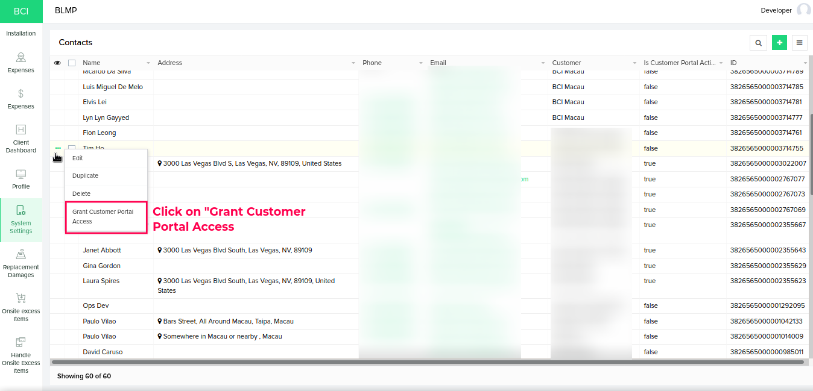

*Image 10: Granting customer portal access from Contact module.*

​		If customer is already given access to customer portal *Grant Customer Portal Access* action will not be available any more. Instead you can find a option called  *Revoke Customer Portal Access*, This option allow to revoke access given to customer portal for a given customer as shown in *Image 11*. You can also use *Is Customer Portal Active* column to check a contact is having customer portal access or not. 

> ***Note:*** 
>
> * *If customer didn't get invite mail in inbox ask them to check in spam or trash once.*
> * *Invalid email ID may be another reason why invite was not sent.*
> * *Maximum number of customer portal user may have reached.*

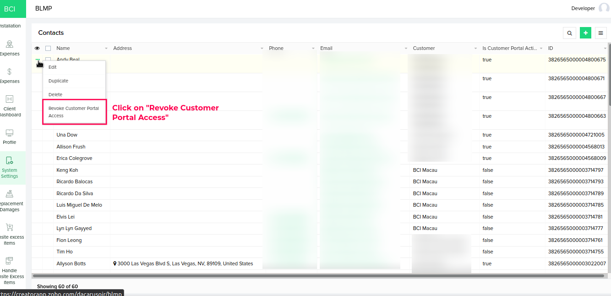

*Image 11: Revoking customer portal access from Contact module.*

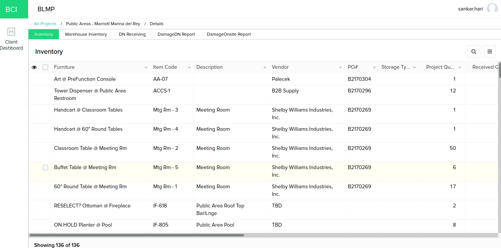

*Image 12: Customer project detail view*

We will discuss regarding the customer portal module in details under [Customer Portal](#customer-portal) section. For information you can also refer to this [Zoho Creator Documentation](https://www.zoho.com/creator/newhelp/application-sharing/understand-customers.html).

##### Employees

​		Employees are application users, These are who is going play various roles in the BLMP Application like Project Manager, Project Coordinator, Warehouse Staff, etc. Based on the roles under which a employee is getting added, the some of modules access will be restricted. For Example, Let us assume we are adding a user under Warehouse Manager Role. He/She will be access to module that are specific to warehouse handling like Overall Inventory, Warehouse Inventory, Warehouses, Picking, etc.  

​		We have used Zoho Creator's roles and permission features to grant or restrict access to various modules of BLMP Application. To know more about the roles and permission please refer this [Zoho Creator Documentation](https://www.zoho.com/creator/newhelp/application-sharing/understand-users.html)

​		You can add a new employee to the application from *System Settings &#129042; Employees &#129042; Add new Employee* button as shown in the *Image 13*.

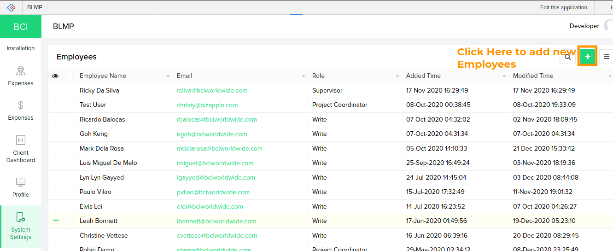

*Image 13: Employee list report.*

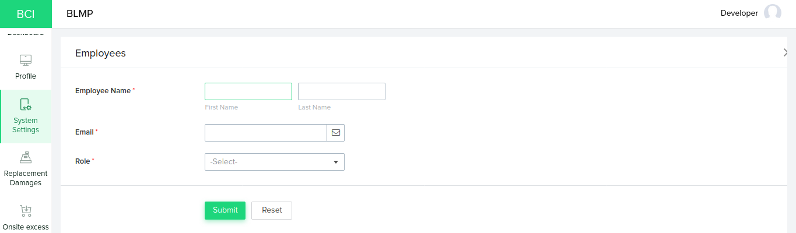

*Image 14: Form to add new employee in application*

​	Once employee details are entered and clicked on submit. Application will add this Employee as user in the BLMP application. An email invite will be sent to email ID given in from while adding a new user.  If you try to edit a existing employee's email ID access to old email ID will be revoked and Invite will we sent to new email ID.

> ***Note:*** 
>
> * *User email address should be unique.*
> * *Please check for invite mail in Spam and Trash mail too.*
> * Invalid email ID.
> * Adding the user may fail when maximum number purchased user license have reached.

